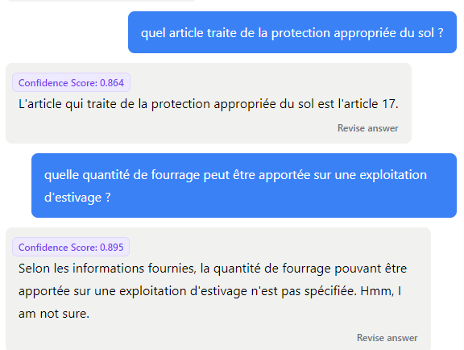

*Sources*: 
* [*guide de l'Etat de  Genève*)(https://www.ge.ch/document/guide-intelligence-artificielle)
* [*100 outils IA*](https://outilia.notion.site/b36ebb86a60f4adfae1ea0c9186f419c?v=795b5a44d1d34d18800e0be65f8232b8)
* *Cours "Intelligence artificielle: Une perspective pragmatique pour professionnel-les non-spécialistes" (Prof. Di Marzo / Krebs / Friha, UNIGE)*
* *<https://www.techopedia.com/top-10-most-popular-ai-tools>*
* *<https://clickup.com/blog/ai-tools>*
* *<https://www.forbes.com/sites/bernardmarr/2023/02/28/beyond-chatgpt-14-mind-blowing-ai-tools-everyone-should-be-trying-out-now/?sh=2581c9627a1b>*
* *<https://www.techchores.com/top-10-ai-tools-like-chatgpt-you-should-not-miss>*

... et encore beaucoup d'autres ! Liste d'outils IA continuellement mise à jour : [Always Up-to-date AI Tools Database](https://dev-share.clickup.com/9805000210/gr/h/946rvgj-16/6be1ba8fcf3f101?_gl=1*xghqd4*_gcl_au*MTQ2MzY3OTY5MS4xNzAyMTEyNjQx)

Quelques [généralités](https://academieweb3.com/comment-utiliser-lia/) sur l'utilisation d'outils d'IA par J.-B. Berthoux

[Grammarly](https://www.grammarly.com/) : amélioration de la communication écrite

[Taskade](https://www.taskade.com) : AI app that combines and synchronizes five AI tools in a single workspace

[guide](https://file.notion.so/f/f/e0c4cd4c-5dcc-4d82-b312-433753e87d14/b9733a15-6093-47d8-8528-93f41e95138b/Caroussel_-_Faire_une_BD.pdf?id=74cdea7a-09c0-41a9-9e40-3f5552ade256&table=block&spaceId=e0c4cd4c-5dcc-4d82-b312-433753e87d14&expirationTimestamp=1718956800000&signature=QaCOtUIALbNIlDvGZ9wgBoruY9pPEPuZer90OQmriMc&downloadName=Caroussel+-+Faire+une+BD.pdf) de J.-B. Berthoux pour réaliser une BD à l'aide de Midjourney

[Udio](https://www.udio.com/) : pour créer de la musique

[Perplexity](https://www.perplexity.ai/) : moteur de recherche alimenté par les grands modèles de langage 
 de J.-B. Berthoux sur l'utilisation de perplexity

## Analyse / recherche d'informations

* [AskYourPDF](https://askyourpdf.com) (online+plugin)
* [Claude 2](https://poe.com/Claude-2-100k)

## Texte et écriture

* Rédaction
  * Document AI sur Google Cloud
  * ChatGPT
  * [Claude 2](https://poe.com/Claude-2-100k)
  * Flapper.ai
  * FutureDesk
  * [Bard](https://bard.google.com)
  * [NovelAI](https://novelai.net) (génération d'histoires)
  * GPTminus1.com: This Tool can rewrite your AI-generated content and fool AI Detectors by randomly replacing words with their synonyms in your text
* Assistant de messagerie
  * Rasa.io
  * SummrAIz
  * Ultramail
* Paraphrase
  * StudyCrumb
  * Linguix
  * Netus AI
  * [QuillBot](https://www.quillbot.com)
  * [Legal Robot](https://legalrobot.com/)("traduit" les textes légaux en textes compréhensibles)
* Résumé
  * Wordtune
  * Rewordify
  * Jasper
  * [QuillBot](https://www.quillbot.com)
* Conteur d’histoires
  * MyTales
  * Maigic Book
  * Artflow ai
* Traducteur
  * [DeepL](https://www.deepl.com/translator)
  * [textshuttle](https://textshuttle.com/) (y.c. suisse allemand)
  * [Google Translate](https://translate.google.com)
  * [QuillBot](https://www.quillbot.com)
  * ChatGPT
  * Microsoft Translator 
  * IBM Watson Language Translator 
  * Systran
  * Linguee
  * MateCat
  * SDL Language Cloud 
  * Yandex.Translate
  * Promt
 * Brainstormer
  * IdeaBot.ai
  * Ideaflip.com

## Affaires et administration

* Gestion de projets
  * Asana (gestion de tâches, recommandation de priorités, planification automatique, attribution de ressources)
  * Trello (gestion de tâches, recommandation de priorités, planification automatique, attribution de ressources)
  * Smartsheet (planification et allocation des ressources)
  * Resource Guru (gestion des ressources)
  * Microsoft Project (analyse prédictive, anticipation des problèmes et optimisation des ressources)
  * Wrike (prédiction de délais, optimisation des charges de travail)
  * Tableau (analyser les données du projet, outils prédictifs)
  * Power BI (analyse de données, tableaux de bords)
  * Slack (chatbots pour réponses automatisées)
  * Microsoft Teams (collaboration et communication)
  * RiskWatch (gestion des risques)
  * ARM (gestion des risques)
  * Zendesk (chatbot pour support projet)
* Productivité
  * Numerous.ai
  * Akkio
  * AlphaResearch
  * Zapier (automatisation de tâches répétitives)
  * Integromat (automatisation de tâches répétitives)
* Support client
  * ReviewWriter
  * CaffeinatedCX
  * Cody
* Ressources Humaines
  * Cody
  * Huru
  * AI Resume Parser
  * Workday (solutions complètes de gestion des ressources humaines)
  * IBM Watson Talent (recrutement, gestion des talents, analyse des compétences)
  * Oracle Cloud HCM (suite complète de gestion des ressources humaines)
  * SAP SuccessFactors (recrutement, gestion des talents et de formation)
  * Cornerstone OnDemand (gestion des talents)
   * BambooHR (gestion des ressources humaines)
   * Ultimate Software UltiPro (gestion des ressources humaines et des talents, analyse données RH)
  * SmartRecruiters (recrutement)
  * ADP DataCloud (analyse données RH pour la prise de décisions) 
* Assistant Juridique
  * LexMachina
  * Genie
  * Casetext
* Présentations
  * Gamma
  * AutoSlide
  * Tome
  * Beautiful.ai
  
## Image et illustration

* Art
  * Draw3D
  * Artprint
  * Artimator
* Assistant de conception
  * MarketingBlocks AI
  * Weaverse
  * Fotor
* Édition d'images
  * [CleanUp.Pictures](https://cleanup.pictures/) (retouche d'images)
  * Cre8tiveAI
  * SolidGrids
  * Codeformer
* Conception
  * Mokker
  * Astria
  * Designs.ai
* Générateur d'images
  * FireFly
  * [DALL-E](https://www.bing.com/images/create) (intégré à ChatGPT Plus) (NB: échoue à générer une image avec du texte précis indiqué dans le prompte - *the reason this occurs is because the tool is likely using a character-based model instead of a word-based model. This means that it is only considering the individual characters in the image, rather than the words as a whole. Therefore, when it prints the text, it is only considering the individual characters and not the word as a whole.*)
  * Midjourney ([guide](https://academieweb3.com/comment-utiliser-midjourney/) de J.-B. Berthoux)
  * [civitai](https://civitai.com)
* Générateur de logo
  * [Looka](https://looka.com/)
  * CandyIcons
  * Logomaster.ai
  * Logomakerr
  * Stable Diffusion
  * Tailor Brands
  * Designs.ai
  * DocLogo
 

## Audio et musique

* Générateur de sons
  * [Soundraw](https://soundraw.io/)
  * création de chansons à partir de texte : https://www.suno.ai/
* Edition audio
  * [Podcastle](https://podcastle.ai)
  * [Lalal.ai](https://www.lalal.ai/) (audio source separation)
  * Krisp
  * Audo Studio
  * Aflorithmic
* Musique
  * Soundful
  * Mubert
  * Beatoven
* Synthèse vocale
  * [Murf](https://murf.ai/) (text-to-speech)
  * Resemble
  * Veed
* Transcripteur
  * [Fireflies](https://fireflies.ai) (prise de note et transcriptions depuis des outils de vidéoconférences comme Zoom, Teams ou Webex)
  * [Krisp](https://krisp.ai) (prise de note et transcriptions depuis des outils de vidéoconférences comme Zoom, Teams ou Webex, avec nettoyage des bruits parasites)
  * Whisper
  * Speechtext.ai
  * EchoFox
* Interprétation (traduction orale)
  * Google Translate
  * DeepL
  * Microsoft Translator
  * IBM Watson Language Translator
  * SDL Language Cloud
  * SYSTRAN Pure Neural Server
  * iFlytek Translator
  * Prompsit Language Engineering 

## Vidéos et illustration

* Vidéos personnalisées
  * Scribe
  * Story Bard
  * Rephrase AI
* Montage vidéo
  * Rawshorts
  * Adobe Sensei
  * Vidyo.ai
* Générateur vidéo
  * Moovly
  * Pictory
  * Synthesia
  * [Deep Nostalgia](https://www.myheritage.com/deep-nostalgia)(animation d'images)
  * [Gen-1](https://futurism.com/the-byte/stable-diffusion-creator-ai-stylized-video)(text-to-video)
  * [civitai](https://civitai.com)
  * [Lumen5](https://lumen5.com/)
* 3D
  * Recraft
  * Alpha3D
  * Real Life 3D

## Développement et informatique

* Prompt
  * AutoGPT
  * Taskade
  * PromptPal
* [Assistant de code](https://sourceforge.net/software/ai-coding-assistants)
  * GitHub Copilot
  * ChatGPT
  * AskCodi
  * MLOps
* Développeur
  * Flutterflow
  * Durable
  * Browse AI
  * HuggingFace
* Low-Code/No-Code
  * Bubble
  * Builder.ai
  * Appy Pie
* Intégration IA
  * Microsoft AI Builder
  * IBM Watsonx.ai
  * Amazon Bedrock

## Education et formation

* Assistant d'éducation
  * Prepsup
  * TeacherMatic
  * OpExams
* Recherche
  * Consensus
  * Branchminds
  * SciSummary
* Ressources
  * Scoop.it
  * Scholarcy
  * to teach
* Moteurs de recherche IA
  * There's An AI for That
  * AI tool guru
  * Ai Business Too

## Ventes et marketing

* Référencement
  * SemRush
  * Surfer SEO
  * Frase
* Réseaux sociaux
  * Munch
  * StoryLab
  * SocialBee
  * Brandwatch (surveillance des réseaux sociaux et des conversations en ligne)
  * Talkwalker (écoute et analyse des réseaux sociaux)
* E-commerce
  * Weaverse
  * SolidGrids
  * Writerly.ai
* Ventes
  * MarketingBlocks AI
  * Oppwiser
  * Oliv AI
* Marketing (Salesforce et HubSpot considérés comme les deux meilleurs CRM marketing)
  * Cody
  * Jasper
  * adcopy.ai
  * HubSpot (automatisation du marketing, optimisation du contenu et gestion de la relation client)
  * Salesforce (analyses pour le marketing et les ventes)
  * Google Analytics (analyse du trafic web et comportement des utilisateurs)
  * Adobe Marketing Cloud (analyse client, optimisation du contenu, marketing personnalisé)
  * Mailchimp (marketing par e-mail)
  * Zoho CRM (notation des prospects et des contacts, analyse prédictive, analyse de sentiments)

## Styles de vie et divertissement 

* Mode
  * Designovel
  * Vue.ai
  * Bodify.io
* Immobilier
  * Askporter
  * REimagineHome
  * Epique.ai
* Jeux
  * Ludo.ai
  * Leonardo.ai
  * Scenario
* Voyage
  * Roam Around
  * Travelandz
  * Trip Planner AI
* Santé
  * Merative
  * Viz.ai
  * Enlitic Curie
* Sport
  * Endurance
  * FitnessAI
  * Alfa AI

## Plateformes
* [Anakin](https://anakin.ai/)
* [Steamship](https://www.steamship.com/)

## Divers

* Général
  * [SwissGPT](https://alpineai.ch/products/) : a multi-layered system designed for secure and efficient use of AI in businesses
  * Perplexity.ai: It is an AI chatbot and an alternative to ChatGPT. It also provides the sources of information from where it is taken and has access to the web
  * Microsoft Designer: You can use this tool to generate social media designs and make presentations
  * You TLDR: This Tool helps to summarize, download, search within YouTube videos, and interact with them

* Pharma
  * PharmaSUGEN (analye et interprétation de diverses sources (médias sociaux, forums, etc.) pour comprendre l'expérience des patients, les effets secondaires et les tendances du marché)

## Outils testés

### ChatBase

* seulement 1 chatbot gratuit
* limite à 400'000 caractères
* nombre de messages limités
* mauvais résultats (cf. exemples - sources : OPD (sans annexes) + Annexe 8)

.

.

(problème du texte barré dans le pdf ! ne fournit pas toutes les informations)

### AskYourPDF

Version gratuite trop contraignante en terme de limites de taille des documents "chargeables"

### Zapier

Création de chatbots avec ses propres sources de données impossible avec un compte Free


