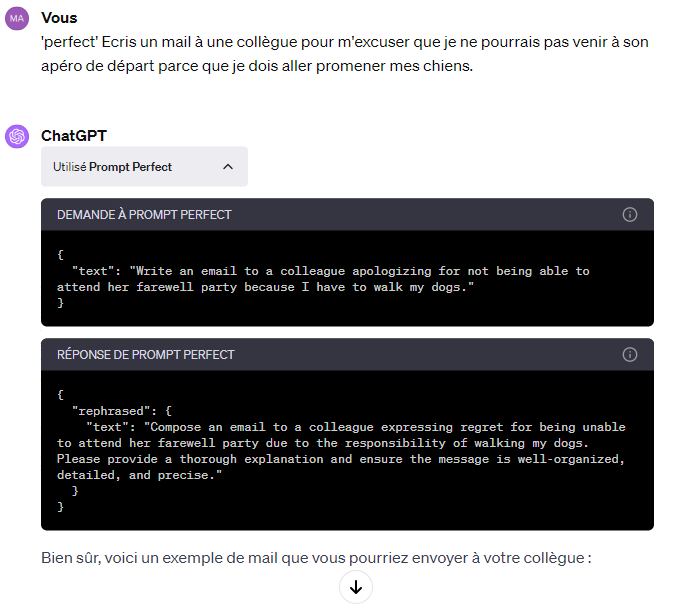
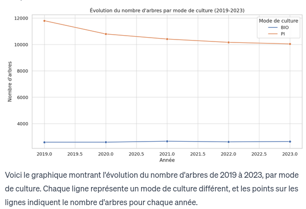
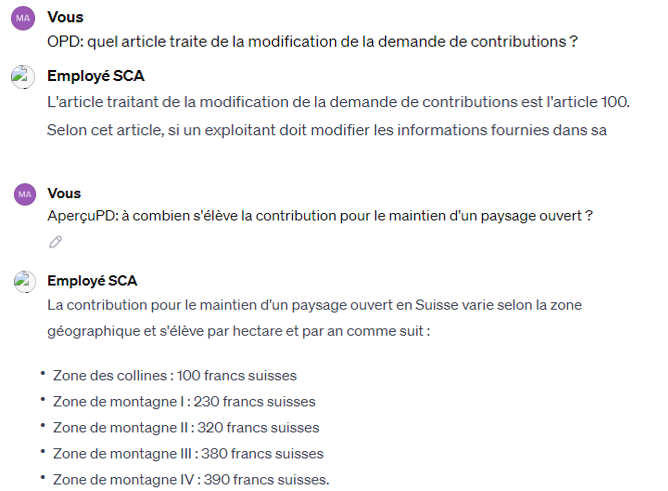

## ChatGPT 4.0

### Repérer des termes dupliqués dans une liste 

NB : ne fonctionnait pas avec GPT-3.5

***Y a-t-il des verbes qui reviennent plus d'une fois dans la liste ci-dessous ? Si oui, lesquels ?***  
propose / réalise / estime / crée / aides à [formuler/créer/préparer/élaborer/me préparer pour ...] pour [une start-up qui ...] / identifie / évalue [la performance] / élabore / rédige / donne / formule / mène / génère / développe /écris / cartographie [le parcours ...] / énumère / prépare / utilise [l'analyse SWOT] pour concevoir / examine [notre proposition/ce site web] et suggère [des façons de l'améliorer pour la rendre plus ...] / conçois / fournis / analyse [le parcours/une crise récente ...] / examine [le CV pour ...] et évalue / élabore / estime / présente / suggère / effectue / guide [le client à travers le processus] / conçois / imagine 

   
Oui, il y a des verbes qui reviennent plus d'une fois dans la liste. Voici les verbes qui apparaissent plus d'une fois : 
"propose" apparaît deux fois. 
"réalise" apparaît deux fois. 
"estime" apparaît trois fois. 
"crée" apparaît deux fois. 

### Compter l'occurrence des mots 

NB : ne fonctionnait pas avec GPT-3.5 ; prompt à affiner (mots <i>contribution</i> et <i>contributions</i> sont encore comptés séparément)

***Compte le nombre d’occurrence totale de chaque mot dans le texte ci-dessous ; réponds par un tableau contenant le mot en 1ère colonne et l’occurrence en 2ème colonne; le tableau doit donner le résultat pour tout le texte (1 ligne par mot, il ne doit pas y avoir de doublons dans la 1ère colonne) ; le tableau doit être trié par ordre décroissant du nombre d’occurrences ; ne prends en compte que les mots de plus de 3 lettres ; un mot et ses formes dérivées ne doivent être comptabilisés qu’une fois.*** Par exemple pour la phrase “tu es agriculteur et je suis agricultrice” le résultat doit être :
être;2 
agriculteur;2 

Le texte à analyser est :  
Contributions au paysage cultivé pour le maintien d’un paysage rural ouvert : outre la contribution pour surfaces en pente et la contribution d’estivage, une contribution pour les exploitations qui ont une part élevée de surfaces en forte pente est également allouée sous cette rubrique. De plus, les exploitations qui estivent leurs animaux reçoivent une contribution de mise à l’alpage. 
Contributions à la sécurité de l’approvisionnement pour le maintien d’un approvisionnement sûr de la population en denrées alimentaires : Elles sont versées en fonction de la surface, à condition que les exploitations respectent une charge minimale en bétail sur les surfaces herbagères. La contribution pour les terres ouvertes et les cultures pérennes contribue en outre à encourager les grandes cultures et notamment la culture de céréales fourragères en Suisse.

   
Voici un tableau qui répertorie le nombre d'occurrences de chaque mot (de plus de 3 lettres) dans le texte fourni, trié par ordre décroissant d'occurrences : 

<table border="1">
  <tr>
    <th>Mot</th>
    <th>Occurrence</th>
  </tr>
  <tr>
    <td>pour</td>
    <td>5</td>
  </tr>
  <tr>
    <td>contribution</td>
    <td>5</td>
  </tr>
  <tr>
    <td>surfaces</td>
    <td>3</td>
  </tr>
  <tr>
    <td>exploitations</td>
    <td>3</td>
  </tr>
  <tr>
    <td>contributions</td>
    <td>2</td>
  </tr>
  <tr>
    <td>paysage</td>
    <td>2</td>
  </tr>
  <tr>
    <td>maintien</td>
    <td>2</td>
  </tr>
  <tr>
    <td>outre</td>
    <td>2</td>
  </tr>
  <tr>
    <td>pente</td>
    <td>2</td>
  </tr>
</table>

 
Notez que seules les 10 premières lignes sont affichées ici pour des raisons de concision. Si vous avez besoin de la liste complète, faites-le moi savoir. ​​

## Plugins

### Utiliser le contenu d'un PDF pour répondre à la question (plugin *Ai PDF*)

   
Selon les données du pdf contenu à l'URL ci-dessous, quelle réduction faut-il appliquer pour une fauche précoce des prairies extensives ? 
https://www.blw.admin.ch/dam/blw/fr/dokumente/Instrumente/Direktzahlungen/DZV%20fr%20mit%20Weisungen%202024.pdf.download.pdf/DZV%20fr%20mit%20Weisungen%202024.pdf

  

   
Selon le document "Ordonnance sur les paiements directs" du BLW (Bundesamt für Landwirtschaft) pour l'année 2024, les informations suivantes concernant la fauche précoce des prairies extensives sont mentionnées :

<b>Dates de Fauche</b> : Les prairies extensives doivent être fauchées au moins une fois par an. La première fauche ne doit pas avoir lieu avant le 15 juin en région de plaine, avant le 1er juillet dans les zones de montagne I et II, et avant le 15 juillet dans les zones de montagne III et IV. Le canton peut avancer ces dates de deux semaines au plus dans certaines régions (page 83).

<b>Indemnités</b> : Dans un projet de mise en réseau, si l'herbe est laissée à sécher sur place (pour en faire du foin) et qu'une faucheuse préservant la faune est utilisée, l'indemnité passe de 700 francs à 1 000 francs (pages 32, 31).

<b>Réductions pour Non-Respect des Conditions</b> : Si les conditions et charges ne sont pas respectées, notamment si la date de fauche n'est pas respectée ou s'il n'y a pas de fauche annuelle, une réduction de 200 % × CQ I peut être appliquée (page 134).

Ces informations indiquent les directives et les conséquences financières liées à la gestion des prairies extensives, y compris les dates de fauche et les indemnités associées. Nous avons terminé de traiter l'ensemble du document avec le plugin de recherche PDF. Que souhaitez-vous savoir d'autre ?

### Accéder à un PDF stocké à une URL et générer un document (.docx ou .pdf) du texte traduit en allemand (plugin *AskYourPDF*)

NB : sans préciser d'utiliser le plugin *AskYourPDF*, cela n'a pas marché car il utilise *WebPilot* et n'arrive pas à lire le pdf.

  

   
Accède au contenu de la page https://www.vs.ch/documents/15726774/18619542/Mod%C3%A8le_procuration+saisie+internet+donn%C3%A9es+agricoles_FR.pdf/32a79212-2c21-03a6-34f3-15e8816e7917?t=1678542930897 en utilisant le plugin AskYourPDF, puis génère un document docx contenant la traduction en allemand de ce contenu.

ChatGPT retourne un lien qui permet de télécharger le document traduit en .docx ou .pdf.

### Connaissance sur le monde réel (plugin *Wolfram*)

  
***Réponds à cette question en utilisant le plugin Wolfram ; est-ce que tu connais la plante Bunias orientalis ? est-ce que tu peux en faire une illustration ?***

### Amélioration du prompt (plugin *Prompt Perfect*)

### GPTs

#### GPTs publics

##### Advanced Data Analysis

  
(Charger pdf en pièce jointe) ***Dans le fichier joint, chaque ligne représente un arbre ; la 2ème colonne indique l'année et la 3ème colonne le mode de culture ; crée un graphique montrant l'évolution du nombre d'arbres dans le temps par mode de culture***

#### GPTs personnalisés

##### Exemple : recherche dans les connaissances enregistrées

##### Exemple : générer e-mail selon template

