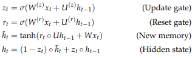
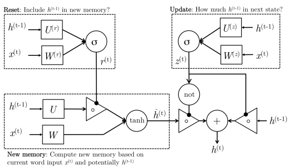
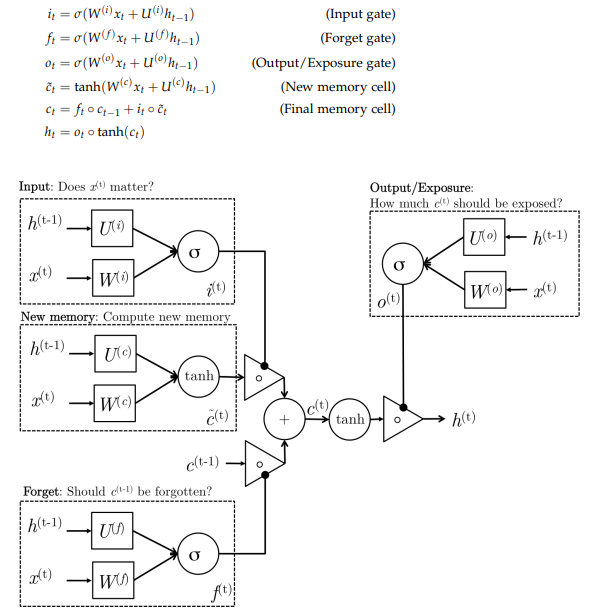
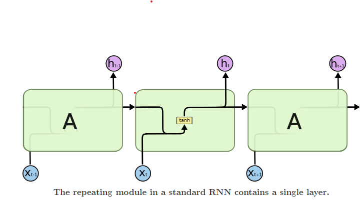
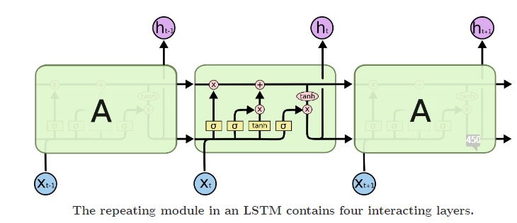
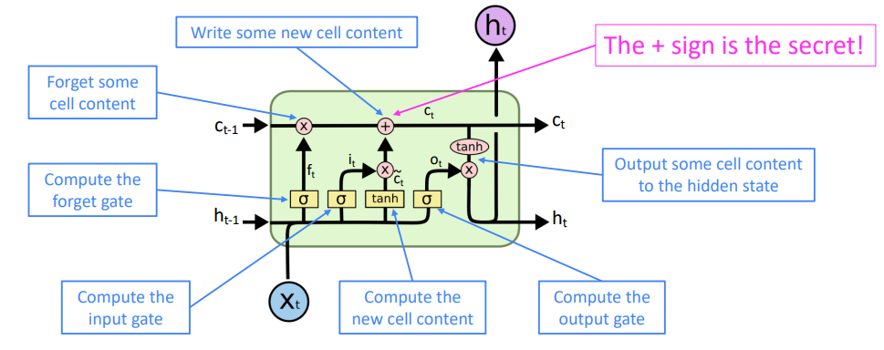
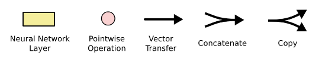
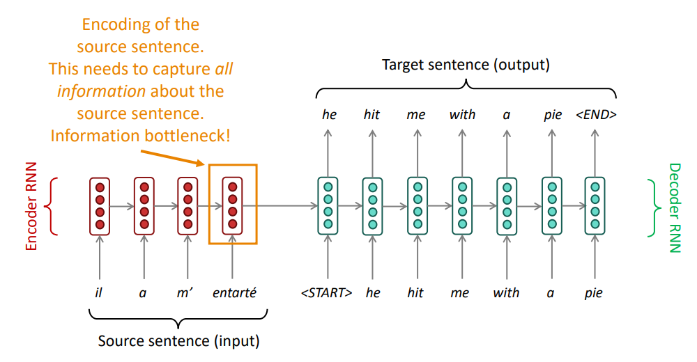
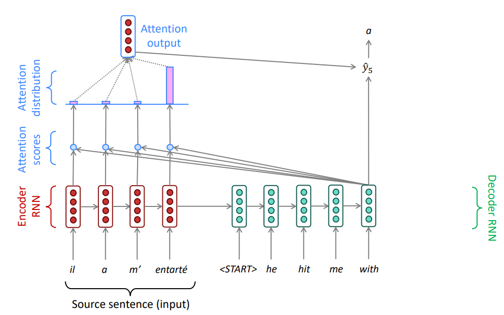
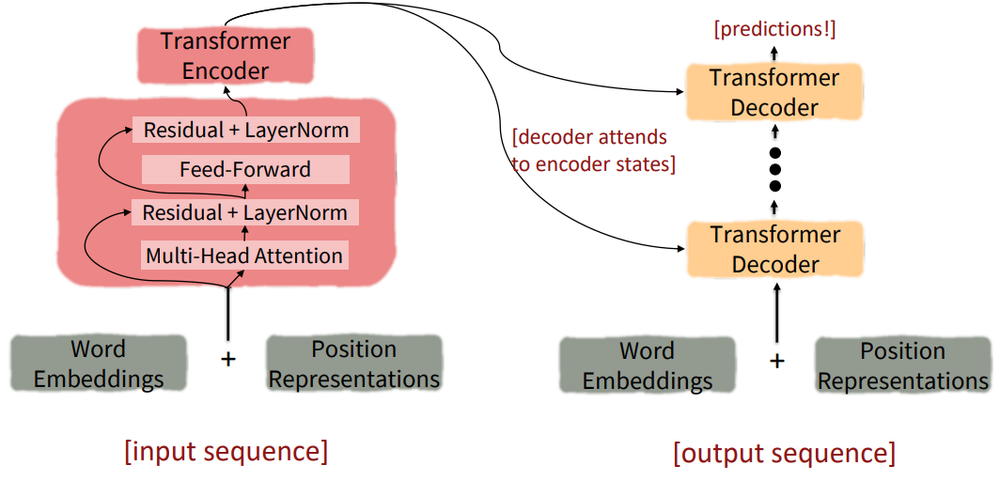

6.	ChatGPT

6.1.	De GPT à ChatGPT

Il y a lieu d'opérer une distinction évidente entre GPT et ChatGPT. Le premier est un modèle de langue à capacité générique développé pour comprendre et générer du texte qui peut être optimisé spécifiquement pour une variété de tâches de TAL. Le deuxième est une application spécifique de GPT conçue pour des interactions en langage naturel produisant des réponses cohérentes et contextuellement pertinentes dans un cadre conversationnel. Comme l'affirme ChatGPT lui-même, "ChatGPT est optimisé pour comprendre les requêtes des utilisateurs et y répondre de manière engageante et informative, rendant l'interaction avec la machine plus naturelle et intuitive" (discussion du 17.01.2024).
La version initiale de ChatGPT se base sur le modèle GPT-3.5. Cette version améliorée de GPT-3 inclut deux améliorations principales. En premier lieu, là où GPT-3 était entrainé sur du texte brut uniquement, les données d'entrainement incluent des données de code informatique ce qui améliorer sa capacité de raisonnement, par exemple pour la résolution de problèmes mathématiques (Kaylan 2023). Une idée déjà explorée pour la mise au point de Codex (un modèle GPT fine-tuned dans la compréhension et la génération de code informatique), en incluant des données stockées dans GitHub. Cet ajout semble améliorer également la capacité à raisonner en chaine de pensées (Zhao et al. 2023).
Deuxièmement, il avait été observé que GPT-3 produisait du contenu pouvant être offensant et, lors des interactions avec les utilisateurs, peinait à suivre les instructions de son interlocuteur. En effet, les modèles de langue comme GPT-3 sont entrainés à prédire le mot suivant, pas à mener une conversation. En outre, ils ne doivent pas reproduire certains contenus vus à l'entrainement (contenu offensant, par exemple). Ils doivent donc être affinés à l'aide de données spécifiques pour en faire des modèles conversationnels. Une approche pourrait consister à poursuivre l'entrainement et spécialiser (fine-tune) le modèle en utilisant des données conversationnelles (e.g. en utilisant des conversations de plateformes comme Reddit ; Zhang et al. 2020). Ce procédé de type instruction fine-tuning présente deux inconvénients majeurs : adapter le modèle à de nombreuses tâches nécessite une dispendieuse collecte d’exemples pour l’apprentissage ; la fonction objective du modèle de langue ne correspond pas aux préférences humaines (par exemple : certaines erreurs de prédiction sont plus graves que d’autres d’un point de vue humain, alors qu’elles sont pénalisées de la même manière par le modèle) (Hashimoto 2024e). L'idée retenue pour ChatGPT procède plutôt en combinant apprentissage supervisé et apprentissage par renforcement, une méthodologie d'alignement, connue sous l'acronyme RLHF (Reinforcement Learning from Human Feedback).

Introduit avec InstructGPT (modèle d'OpenAI basé sur GPT-3 ; Ouyang et al. 2022), le RLHF a pour but de fournir des réponses globalement pertinentes et de conformer le modèle aux préférences humaines (Sagot 2024b ; Cao et al. 2023). Un modèle est considéré comme aligné s’il présente les qualités suivantes : utile (helpful : « the output should follow the user’s intention, and help the user solve their task », fiable/honnête (truthful : « the output contains accurate information, and doesn’t mislead the user») et inoffensif sous tout point de vue (pour les êtres humains, l’environnement, les institutions. etc. ; harmless) (Ouyang et al. 2022}). Les composantes nécessaires pour un système RLHF sont : le LLM pré-entrainé que l’on cherche à aligner, un modèle de récompense apprenant par feedback humain, et un algorithme d'apprentissage par renforcement entraînant le modèle de langage. 
La méthode proposée par InstructGPT procède en trois étapes. 1) Tout d’abord, une étape d’affinement supervisé (supervised fine-tuning) qui se base sur un ensemble de données annotées par des humains (échantillonnage de prompts pour lesquels un annotateur produit le résultat escompté) met à jour le LLM (GPT-3 dans le cas d’InstructGPT). 2) La deuxième étape vise à mettre au point un modèle de récompense (reward modeling) : pour un prompt donné, le LLM pré-entrainé génère plusieurs réponses, classées selon certains critères par des annotateurs ; les évaluations par des humains sont utilisées pour entrainer (par apprentissage supervisé donc) un nouveau modèle dont le but est de prédire la qualité (selon les préférences des humains) d'une réponse en fournissant un score. Ce modèle peut être de taille bien plus modeste que le modèle pré-entrainé (6 mia de paramètres pour celui utilisé initialement avec GPT-3 (Ouyang et al. 2022), mais ce n’est pas toujours le cas (Sagot 2024b). Cette étape ne modifie pas les paramètres du modèle mais sert à la troisième étape. 3) Celle-ci est un affinement par renforcement (reinforcement learning) : le modèle mis au point à l'étape précédente est utilisé pour attribuer un score au texte généré par le modèle de langue pré-entrainé. L’apprentissage par renforcement en suivant l'algorithme Proximal Policy Optimization permet d'ajuster les paramètres du modèle de langue pré-entrainé en vue de maximiser ces scores, c’est-à-dire en encourageant la génération de réponses qui sont plus susceptibles d'être évaluées positivement. Cet ajustement se fait par des essais successifs où le modèle apprend à prédire des actions qui augmentent les récompenses futures, basées sur les scores reçus (i.e. ceux fournis par le modèle de récompense). Il est également guidé par la comparaison avec les réponses d'une copie « figée » du LLM de référence, évitant ainsi que les mises à jour apportées entrainent des déviations excessives qui pourraient péjorer la qualité des réponses et les rendre moins compréhensibles pour les utilisateurs (Sagot 2024b). L’ensemble de ce processus aide à obtenir des réponses correctes et alignées sur les préférences des utilisateurs. Si le RLHF a déjà produit des résultats convaincants, ceux-ci demeurent imparfaits et le manque de ressources accessibles notamment pour les benchmarks et l'implémentation rend cette phase d'affinement du modèle ardue (Cao et al. 2023).
La méthodologie RLHF a été reprise pour ChatGPT, à la différence que ce ne sont pas des données d’instructions qui ont été prises pour l’entrainement mais du contenu conversationnel (Sagot 2024b). OpenAI a notamment utilisé des conversations générées par des humains qui jouaient le rôle de l'utilisateur et de l'IA, ainsi que l'ensemble des données d'InstructGPT formatées comme des dialogues (Zhao et al. 2023). C’est en effet une tendance : plutôt que d’utiliser des conversations entre humains, il devient facile de générer de grands corpus d’interactions avec des IA, qui peuvent également être utilisés pour l’affinement du modèle qui progresse dès lors from AI Feedback (RLAIF). La norme actuelle est de combiner les deux approches (RFLxF ; Sagot 2024b). Recourir au RLAIF ou à un fine-tuning utilisant les propres sorties du modèle de langue permet de pallier au manque de données d’entrainement (Hashimoto 2024e). 
Si le RLHF permet de produire des réponses globalement satisfaisantes et respectant les préférences et les valeurs des personnes qui ont entrainé ces modèles, ce fine-tuning n’empêche pas complètement la production de contenu problématique – comme en témoigne les innombrables pages et articles consacrés au jailbreak de ChatGPT (e.g. Bastien 2024 ; Liu et al. 2023b}). Des méthodes de red teaming (des experts externes recrutés pour "attaquer" ChatGPT et tester sa vulnérabilité) sont également mises à profit pour mieux contrer la génération de contenu délétère ou toxique (OpenAI 2023). Dans un jeu de chat et de la souris, les pares-feux sont continuellement sophistiqués dans le but de filtrer a posteriori les textes générés qui s’avéreraient inadéquats, par exemple en arrêtent la génération du texte si du contenu sous droit d’auteur est détecté (Sagot 2024b). Au final, le RLHF ne résout évidemment pas tous les problèmes des grands modèles de langue et demeure une « underexplored and fast moving area » (Hashimoto 2024e).

6.2.	ChatGPT, un agent conversationnel révolutionnaire ?

ChatGPT est donc un modèle GPT optimisé en tant qu'agent conversationnel (chatbot), soit un « système capable d'interagir avec un utilisateur sous la forme d'une conversation » (Sagot 2024b). Se distinguant des agents conversationnels spécialisés à accomplir une unique tâche prédéfinie (par exemple, la réservation d'un billet de transport en ligne) ou à répondre à un ensemble prédéterminé d'instructions (assistants virtuels), ChatGPT est capable de dialoguer avec l'utilisateur sans limitation préalable sur le contenu de l'échange, ce qui en fait un agent conversationnel généraliste (Sagot 2024b).
Méthodologiquement, le développement des agents conversationnels a suivi une trajectoire histoire similaire à celle du TAL (cf. ch. 3). Les premiers agents, spécialisés (à initiative système ou partagée) ou généralistes (e.g. ELIZA) ont été mis au point en suivant une approche symbolique (Sagot 2024b). Bien qu'ils aient l'avantage de ne pas nécessiter d'un grand corpus de données pour leur mise au point et que certains d'entre eux soient capables de mémorisation, ils impliquent la définition explicite de règles, dont le nombre exigé pour une conversation étoffée devient rapidement ingérable. Avec l'augmentation exponentielle des données à disposition, les approches par récupération d'informations (localiser la réponse au sein d'un ensemble de questions et réponses) et par traduction automatique (séquence-à-séquence) ont été privilégiées. Les réponses produites par ces systèmes présentent toutefois le défaut de manquer de cohérence notamment en raison de leur inaptitude à mémoriser les interactions passées et leur absence de contexte extralinguistique fixe (Sagot 2024b). D'autres approches incluent l'apprentissage par renforcement, qui modélise la production de la phrase comme « un moyen de se rapprocher au mieux d'un but global, celui du succès de la conversation" » – une conversation fructueuse génère des récompenses que le modèle cherche à maximiser (Sagot 2024b). ChatGPT comme BARD et bien d'autres appartiennent à une dernière catégorie d'agents conversationnels, basés sur les modèles de langue : "la production de chaque réponse peut être modélisée comme la production successive de mots les plus probables suivant l'état actuel de la conversation" (Sagot 2024b).
A ce stade, grâce aux évolutions historiques que nous avons retracées tant dans le domaine du TAL que dans le domaine de l’intelligence artificielle, il apparait évident que ChatGPT ne constitue pas une révolution d’un point de vue technologique. Bien que l’on constate une accélération du transfert des résultats de la recherche vers des applications de la vie réelle (Sagot 2024c), il s’inscrit dans la trajectoire esquissée par ses prédécesseurs et s’assied sur des paradigmes et des méthodologies qui préexistaient. C’est plutôt son accessibilité au grand public, gratuitement, qui l’a érigé en révolution sociétale (Sagot 2024b).
Comment expliquer un tel succès ? Sa quasi-universalité étant donné le nombre langues avec lesquelles il peut interagir, sa capacité de mémorisation et sa flexibilité particulières ont certainement aidé à convaincre un grand nombre de curieux à l’essayer puis l’adopter (Nazir et Wang 2023). L’accompagnement et la préparation des utilisateurs à son utilisation peuvent également avoir joué en sa faveur. Avant les modèles Llama, Meta avait sorti Galactica deux semaines avant ChatGPT. Il a dû être retiré trois jours plus tard après avoir essuyé une salve de critiques d’utilisateurs déçus et surpris par les hallucinations du modèle (https://www.lebigdata.fr/galactica-flop-ia-meta). Quelques jours plus tard, la génération de réponses erronées n’a pas suffi à éteindre la « hype » qui s’est cristallisée autour de ChatGPT... Rendu public le 30 novembre 2022, il lui aura fallu 5 jours pour atteindre le million d’utilisateurs, un palier que Netflix aura mis plus de 3 ans à atteindre. Connaissant l’essor le plus rapide de l’histoire, devant Instagram ou TikTok, le chiffre est multiplié par 100 en seulement deux mois. En janvier 2023, il est le 51ème site avec le plus de trafic au monde, un classement dominé par Amazon ou Zoom (Badri et al. 2023). Son taux de pénétration est notable : selon une enquête d’Ipsos, un an après son lancement, 83% des Français en ont entendu parler et plus de la moitié (55%) l’utilise au moins une fois par mois (Mercier et al. 2023). ChatGPT a probablement connu son « moment Dropbox » (« such moments have happened previously when staff began to use online tools like Dropbox and Wikipedia for work without formal introduction or monitoring by IT departments » ; Ada Lovelace Institute 2023). Les LLMs récents se différencient toutefois par une adoption bien plus rapides que les outils informatiques grand public qui l’ont précédé (Ada Lovelace Institute 2023). 
6.3.	Limites et perspectives

Malgré ce retentissant déploiement de nombreux aspects de ce chatbot demeurent perfectibles. Une limitation évidente et majeure est la dépendance aux données d’entrainement qui engendre une barrière temporelle : ses connaissances n’étant pas actualisées, ChatGPT ignore tous les faits ultérieurs à 2021 (pour GPT-3.5). Afin d’étendre ses capacités, ChatGPT a rendu possible le développement de plugins (les « "eyes and ears" of LLMs » ; Kaylan 2023) qui permettent par exemple : les calculs numériques, l'accès à des données externes à jour et fiables, la citation des sources, l'automatisation de tâches ou encore une expérience utilisateur plus agréable (Hadi et al. 2023 ; Kaylan 2023). Le modèle doit ainsi apprendre quand faire appel à ces outils externes (avant ou pendant la génération de texte). Une méthode utilisée par ces modules complémentaires est par exemple la RAG (Retrieval Augmented Generation) : si le modèle l’estime nécessaire, il fait appel à une base de données documentaire pour y récupérer des informations et les ajoute au contexte du prompt initial (Sagot 2024c). La RAG est une méthode prometteuse pour compléter les capacités des modèles de langue (e.g. citation de sources) et constitue l’état de l’art pour les tâches de questions-réponses (Yang 2024b). Les développements en cours et futurs de ChatGPT s’orientent en outre vers davantage de multi-modalité, autant pour des tâches cross-modales (e.g. transcription, génération de légendes ou d'images) que mono-monodales (e.g. traduction assistée d’images pour résoudre les ambigüités) (Sagot 2024c).
Parmi les inconvénients de ces grands modèles de langue qui ne sont pas propres aux modèles GPT, le principal est celui du coût (financier et en infrastructures) nécessaire à leur développement et leur maintenance autant qu’à leur utilisation (e.g. Badri et al. 2023). Des avancées remarquées ont eu lieu dernièrement, en vue de les rendre portables et utilisables sans avoir recours à des fermes de calcul (Delbecq 2024). En changeant par exemple la façon dont sont mémorisés les paramètres, le nombre de bit requis par paramètre diminue drastiquement et il devient alors réaliste de charger entièrement un modèle en mémoire, de quoi accélérer l’intégration de l’IA à des appareils mobiles comme les téléphones portables. Cela ouvre également la voie à une optimisation et accélération des performances des supercalculateurs.
La dépendance aux corpus d’entrainement est un autre point sensible de ces modèles de langue. Sans affinement, ces modèles ont amassé des connaissances générales, mais manquent de savoir spécifique sur des sujets de niche qui ne sont pas représentés dans les données d'apprentissage. Les investigations du groupe de Kocoń (Kocoń et al. 2023) leur font d’ailleurs conclure que ChatGPT est "touche-à-tout, mais expert en rien" (« jack of all master of none »). Le développement de modèles d’envergure toujours plus grande (nombre de paramètres) questionne également la disponibilité de données. Ayant déjà exploité la quasi-entièreté des données disponibles sur le web, les performances des LLMs montrent des signes de saturation (LeCun 2024).  
Par ailleurs, l’apprentissage en contexte basé sur l’amorce (prompt-based learning) ne représente pas qu’un atout. Parmi les désavantages, nous pouvons citer : l’inefficacité (le prompt doit être traité à chaque prédiction), une performance moindre que par affinement, la sensibilité à l’amorce (choix des mots, des exemples, etc.) ou encore l’opacité qui entoure ce que le modèle apprend du prompt (Yang 2024a). Aussi, la sensibilité à la formulation du prompt constitue un facteur d’instabilité (Nazir et Wang 2023). Un pan de la recherche se consacre d’ailleurs à des alternatives au fine-tuning qui ne relèvent pas du in-context learning (e.g. parameter-efficient fine-tuning, prefix learning, etc.) (Yang 2024a). En sus, l’apprentissage continu (continual learning, « where models can adapt to new data and tasks without forgetting previously learned information » ; Dey 2023) ouvre un autre domaine d'étude.
En outre, les textes générés par les machines, s’ils sont cohérents et fluides, se distinguent encore relativement aisément de textes produits par des humains. Le choix des mots que ces derniers opèrent ne suit pas les mêmes logiques que la décision probabiliste des LLMs (Sagot 2024b). Des améliorations sont encore nécessaires pour rendre la machine indiscernable d’un être humain.
Ultimement, les modèles comme ChatGPT nous paraissent dotés d’intelligence car les humains associent la capacité à manipuler le langage à cette faculté. Or, parfois qualifiés de perroquets stochastiques (Bender et al. 2021), ils n’ont pas de réelle compréhension ni du monde réel ni des langues. Des approches hybrides les combinant par exemple avec des graphes de connaissances (e.g. SAPBERT ; Liu et al. 2023a) pourraient permettre d’enrichir la capacité de raisonnement du modèle (Yvon 2022). Incorporer des bases de connaissances structurées (symboliques ou basées sur des ontologies) permettrait également d’augmenter la fiabilité des résultats (Kaylan 2023 ; Zhao et al. 2023). En revanche, l’intégration directe de connaissances linguistiques dans le modèle « va à l’encontre de l’augmentation de la taille des données et du nombre de langues prises en compte, et ne constitue pas une piste de recherche très active » (Yvon 2022).
Comme dernier point, il faut également relever des limitations « structurelles » des modèles de langue. Pour atteindre les performances actuelles, les LLMs consomment généralement au moins 1*1013 tokens (0.75*1013 mots) soit environ 2*1013 bytes de données (ou 170'000 ans de lecture humaine à 250 mots/minute 8h/jour) (LeCun 2024). Si cette quantité parait colossale, elle représente 50 fois moins d’informations qu’un enfant de 4 ans aura perçues durant toute sa vie via ses fibres optiques. La raison à cela réside dans le fait que ces modèles se basent sur du texte, un médium « bas débit, approximé et discret » (LeCun 2024). Yann LeCun en conclut : « il n’y a absolument aucun moyen qu’on puisse atteindre le degré d’intelligence [humaine] simplement par le texte » (LeCun 2024). En outre, des restrictions liées à leur architecture ont pour conséquence que les réseaux actuels de taille non infinie ne peuvent pas fonctionner comme approximateur universel et sont donc incapables de résoudre des problèmes extrêmement compliqués comme de la planification (LeCun 2024). De façon notable, peu importe l’entrée reçue (la question posée) à un LLM, c’est toujours la même quantité (fixe) de calculs qui sera effectuée pour générer la sortie ; la rapidité de la réponse ne varie pas avec la complexité de la tâche. Pour ces raisons, le chercheur appelle de ses vœux un changement d’orientation de la recherche et propose d’explorer la piste d’une « architecture pilotée par les objectifs » (LeCun 2024).

6.4.	Enjeux

Les enjeux entourant ChatGPT rejoignent ceux d'autres LLMs. Tout d'abord, l'opacité entoure ces modèles : un faible nombre d'entre eux sont sous licence libre (e.g. BERT, GPT1-2, Llama, Mistral), les plus conséquents ne peuvent être qu’entrainés que par des firmes privées (GPT > 2, Claude, etc.). D'autant plus que la disponibilité du code source ne garantit pas la divulgation (et encore plus la mise à disposition) du corpus d'entrainement – ainsi Llama2, bien que modèle open-source, restreint la description de celui-ci à « a new mix of publicly available online data » (Touvron et al. 2023). Pour ChatGPT, ce manque de transparence – qui caractérise de nombreux modèles de fondation – concerne autant son code source que son corpus d'entrainement. Parmi les modèles de fondation les plus utilisés, GPT-4 arrive à la troisième place des modèles les plus transparents, derrière Llama2 et Bloomz (Simseo 2023). 
Sous l’angle juridique, un certain flou entoure la gestion des droits d'auteur par les IA génératives. Le respect de la légalité de l'accès aux données et celle de leur utilisation pour l'entrainement du modèle - ou leur reproduction au moment de l'inférence - n'est pas garanti. Si une minorité de modèles (comme Bloom) garantissent des sources entièrement conformes (données "blanches", par ex. Wikipédia, textes du parlement européen), d'autres font appel à des données plus discutables (données "grises", accessibles quoique peu ou pas destinées à l'entrainement de LLMs, par ex. articles de presse) voire condamnables (données "noires", ex. SciHub, sites pirates) (Sagot 2023a). La sécurité des données et le respect de la vie privée soulèvent également des interrogations (Nazir et Wang 2023). Afin de mitiger ces risques, les solutions reposent notamment sur l’utilisation de modèles open source, leur exécution locale ainsi que leur affinement (pour plus de précision) (CEU 2023). En Suisse, des initiatives cherchant à réunir milieux académique, économique et public en vue « d’exploiter l’IA de manière responsable et productive pour les individus, les communautés, les institutions et la société dans son ensemble » ont récemment vu le jour dans le sillage des EPF (Seydtaghia 2023). En plus de la création d’un centre dédié à l’IA à l’EPFL, l’initiative Swiss AI conjointe à l’EFPL et à l’EPFZ a pour objectif « de développer et d'entraîner de nouveaux grands modèles de langages [qui] doivent être transparents, fournir des résultats compréhensibles et garantir le respect du cadre légal ainsi que des normes éthiques et scientifiques » (EPFL 2023). La thématique du transfert technologique et de l’innovation surgit également lorsque des acteurs privés s’approprient des recherches qui s’étaient cantonnées jusque-là à des instituts publics (Sagot 2024c). 
D'un point de vue scientifique également, le verrouillage de l'accès aux training data est problématique. Non seulement en termes de reproductibilité des résultats, mais aussi pour juger de leurs performances. En effet, ne sachant pas quels textes le modèle a rencontrés lors de l'apprentissage, comment savoir s'il est capable de généralisation et raisonnement ou s'il répond à une question par reproduction d'une réponse car celle-ci a déjà été vue lors de son pré-entrainement (phénomène de contamination ; Sagot 2024b) ? Cette question de l’évaluation se pose de manière plus générale pour ces immenses modèles (pour des tâches de traduction automatique français-anglais par exemple, il est fort probable qu’à peu près toutes les phrases possibles de longueur raisonnable aient été vues pendant l'apprentissage ; Sagot 2024b). Les « gold standards » de référence ainsi que les critères pour juger de leurs performances ne sont par ailleurs pas triviaux à définir (Hashimoto 2024f). Au manque de transparence entourant le code et les données de ses modèles s'ajoute, comme pour bien d'autres algorithmes d'apprentissage profond, le manque d'explicabilité des réponses fournies. Développer des méthodes dans ce sens permettrait d'augmenter la confiance des utilisateurs (Sagot 2024b).
Les données d'entrainement soulèvent par ailleurs la thématique des biais, qu'ils soient de représentation (genre, etc.) ou de représentativité (langues, typologie des créateurs de contenu, etc.). Les réponses des LLMs reproduisant voire accentuant la vision du monde véhiculée par les ressources utilisées, et malgré les garde-fous mis en place (alignement, etc.), ils reproduisent et amplifient les stéréotypes et les contenus offensants qu'ils ont ingérés (Sagot 2023d). Les biais, qui ne sont donc pas « des "erreurs" commises par la machine mais des tendances humaines sous-jacentes » (Cantens 2023), se distinguent des hallucinations, informations factuellement incorrectes qu'ils déclament, risquant ainsi de contribuer à la propagation de fausses informations. Il existe également des « risques d’information », c’est-à-dire que le modèle régurgite à l’inférence des informations sensibles vues durant son entrainement (Ada Lovelace Institute 2023). Finalement, comme pour toute technologie, des utilisations à des fins malveillantes de ces outils puissants ne peuvent être exclues (Ada Lovelace Institute 2023).
En outre, bien que des recherches s'orientent vers des modèles plus frugaux, la question du coût computationnel, énergétique et environnemental de tels modèles ne doit être ignorée. Leur entrainement est en effet extrêmement demandeur en temps et en argent. Il a nécessité 700'000 heures de calcul (Huot 2022) et coûterait 1.4 mio de dollars avec les technologies actuelles, ce qui représente 81% de moins que les coûts initiaux (Badri et al. 2023). Il a de plus été reporté qu'une conversation avec un LLM coûterait 10x plus qu'une requête dans Google (Badri et al. 2023). Et d’un point de vue écologique, même sans prendre en compte les expériences préparatoires, l’entrainement de GPT-3 a nécessité 936 MegaWatts (Badri et al. 2023) et généré 502 tonnes de CO2 (un Français moyen produit 12 t, un vol Paris-New York 1 t ; Sagot 2024b). De manière générale, l’empreinte environnementale des modèles de fondation n’est pas suffisamment prise en compte actuellement (Courtier-Orgogozo et Devillers 2024).
Finalement, davantage de répercussions sociétales, sur le monde du travail en particulier, sont abordées dans le prochain chapitre.

*Sources:*
* Test

# Accès

* Via la [plateforme web](https://chat.openai.com/)
* Via l'API
* Via le cloud (ex. : Microsoft offre également la version payante de ChatGPT via sa plateforme Azure, ce qui permet aux entreprises de l'intégrer facilement dans leurs applications et services.)

# Sous le capot de ChatGPT

Des briques pour comprendre (un peu) le fonctionnement de ChatGPT

ChatGPT is a web app (you can access it in your browser) designed specifically for chatbot applications—and optimized for dialogue. It relies on GPT to produce text, like explaining code or writing poems.  

GPT, on the other hand, is a language model, not an app. (There is an OpenAI playground that lets you play around with GPT, but GPT itself isn't an app.) It can be tailored to build different functions, like text summarizing, copywriting, parsing text, and translating languages. And it has an open API that lets anyone tap into GPT-3 or GPT-4 to build their own AI applications with its functions. It's the brain behind ChatGPT, yes, but it's also the brain behind other tools like Jasper and Writesonic, or Bing's new AI-powered search features.

GPT-3 is the industry standard for language models right now, just like ChatGPT is the industry standard for AI chatbots—and GPT-4 will likely be the standard soon. (Though Google is currently playing catch up with its newly launched chatbot, Bard, using a different language model called LaMDA.) 

What does this mean for integrations?
Even though GPT is a language model and ChatGPT is a chatbot, they each have their own open API,

Generative Pre-trained Transformer

ChatGPT est un **modèle de langage**, avec une architecture basée sur les transformers

ChatGPT 4 est **multimodal** ; chaque modalité doit être convertie dans une représentation dans le même espace d'*embedding*

https://medium.com/@amol-wagh/whats-new-in-gpt-4-an-overview-of-the-gpt-4-architecture-and-capabilities-of-next-generation-ai-900c445d5ffe

https://the-decoder.com/gpt-4-architecture-datasets-costs-and-more-leaked/
GPT-4 The key points:

GPT-4's Scale: GPT-4 has ~1.8 trillion parameters across 120 layers, which is over 10 times larger than GPT-3.
Mixture Of Experts (MoE): OpenAI utilizes 16 experts within their model, each with ~111B parameters for MLP. Two of these experts are routed per forward pass, which contributes to keeping costs manageable.
Dataset: GPT-4 is trained on ~13T tokens, including both text-based and code-based data, with some fine-tuning data from ScaleAI and internally.
Dataset Mixture: The training data included CommonCrawl & RefinedWeb, totaling 13T tokens. Speculation suggests additional sources like Twitter, Reddit, YouTube, and a large collection of textbooks.
Training Cost: The training costs for GPT-4 was around $63 million, taking into account the computational power required and the time of training.
Inference Cost: GPT-4 costs 3 times more than the 175B parameter Davinci, due to the larger clusters required and lower utilization rates.
Inference Architecture: The inference runs on a cluster of 128 GPUs, using 8-way tensor parallelism and 16-way pipeline parallelism.
Vision Multi-Modal: GPT-4 includes a vision encoder for autonomous agents to read web pages and transcribe images and videos. The architecture is similar to Flamingo. This adds more parameters on top and it is fine-tuned with another ~2 trillion tokens.

OpenAI GPT-4 is said to be based on the Mixture of Experts architecture and has 1.76 trillion parameters.

GPT-4 is rumored to be based on eight models, each with 220 billion parameters, which are linked in the Mixture of Experts (MoE) architecture. 

https://neuroflash.com/blog/gpt-4-wiki/
Enhanced language capabilities and improved performance: One of the remarkable features of GPT-4 lies in its ability to generate creative and coherent text. Thanks to its advanced language modeling techniques, the model can produce human-like responses, making it an invaluable tool for content creation, chatbots, and virtual assistants. GPT-4’s impressive neural network architecture allows it to understand context, grasp nuances, and provide accurate and meaningful outputs.
Larger contextual window: GPT-4 possesses an advanced neural network architecture that allows it to understand more context, nuances, and provide meaningful outputs.
Multimodal content: GPT-4 can process multi-modal content, including text, images, music, and more, opening up possibilities for applications in marketing, entertainment, and virtual reality.
Improved knowledge acquisition: It showcases improved knowledge acquisition and reasoning abilities, comprehending complex information, handling ambiguous queries, and delivering precise answers.
Bigger data base: GPT-4 leverages vast amounts of data available on the internet to provide well-informed insights.

## NLP

https://datascientest.com/introduction-au-nlp-natural-language-processing
https://datascientest.com/nlp-word-embedding-word2vec
https://web.stanford.edu/class/cs224n/slides
http://web.stanford.edu/class/cs224n/readings
http://colah.github.io/posts/2015-08-Understanding-LSTMs

= compréhension, manipulation et génération du langage naturel par les machines

Exemples d'utilisation : traduction, classification de texte, analyse de sentiments, chatbot, etc. 

Généralement 2 aspects

### 1. Linguistique 

= prétraiter et transformer le texte en entrée pour avoir un jeu de données exploitable (nettoyage du texte, normalisation des données, transformation en données numériques)

#### Normalisation des données

* **Tokenisation** = découpage du texte en plusieurs pièces appelés tokens. Ex. : « Vous trouverez en pièce jointe le document en question » -> « Vous », « trouverez », « en pièce jointe », « le document », « en question ».
* **Stemming** = découper la fin des mots dans afin de ne conserver que la racine du mot. Ex. : « trouverez » -> « trouv ».
* **Lemmatisation** = similaire au stemming, mais plus "sophistiqué", supprime uniquement les terminaisons inflexibles et isole la forme canonique du mot (=le lemme). Ex. : « trouvez » -> trouver.
* Autres opérations : suppression des chiffres, ponctuation, symboles et stopwords, passage en minuscule, etc..

#### Représenter les mots sous forme numérique

Premières solutions NLP : dictionnaires de listes d'ensembles de synonymes et hypernimes (relation 'est un') (par ex. WordNet) ; ex. : ; plusieurs limitations : pas de nuance, incapacité à prendre en compte le contexte, pas à jour, etc..

Vecteurs one-hot (*one-hot vector*) : vecteur binaire, aussi grand que le nombre de mots dans le dictionnaire ; ex. de limitations : vecteurs orthogonaux (ne peut pas capturer la similarité), vecteurs aussi longs que le dictionnaire de mots

Vecteurs de mot (*word vectors* = *embeddings*) : 
* obtenir pour chaque mot un vecteur dense => **représentation distribuée** (*distributed representation*) 
* métriques pour mesurer similarité entre 2 mots, par ex. *cosine similarity* (angle entre les vecteurs) ou produit scalaire (angle et magnitude des vecteurs)
* réduire la dimension pour capturer le contexte
* l'*embedding* d'un mot correspond au résultat que retourne une couche dense (= multiplier la matrice d'*embedding* par la représentation one-hot du mot
* 2 catégories de méthodes : *SVD-based* (*count-based*; *embeddings* donnés par la matrice unitaire d'une décomposition en valeurs singulières d'une matrice de co-occurence ; 1x/dataset) et *iteration-based* (l'*embedding* correspond aux paramètres du modèle, qui est entrainé par optimisation d'une fonction objectif ; 1 mot à la fois)
* méthode la plus utilisée : **Word2vec** (*iteration based*)
  - entrainement non supervisé
  - réseau de neurones à 3 couches (1 couche d’entrée, 1 couche cachée, 1 couche de sortie)
  - le résultat de la couche cachée est la nouvelle représentation du mot
  - 2 variantes 
      1. Common Bag Of Words = nourri par le contexte, prédit le mot cible
      2. Skip Gram = nourri par le mot cible, et prédit les mots du contexte
* **GloVe** : combine les 2 types de méthodes *global matrix factorization* (*count-based*) + *local context window* ; les premières capturent bien la similarité des mots, mais mal les analogies ; les deuxièmes capturent des motifs linguistiques complexes au-delà de la similarité, mais n'utilisent pas les statistiques de co-occurence globales -> *weighted least squares model* entrainé sur les occurences globales,  utilise statistiques globales pour prédire la probabilité d'un mot d'apparaitre dans le contexte d'un autre mot

### 2. Apprentissage automatique : appliquer des modèles d'apprentissage automatique ou profond à ce jeu de données

Modèles de language (*language model*, *LM*) pour prédire le mot suivant

* modèles *n-gram* (*n-gram* = groupe de *n* mots consécutifs; ex. : "les étudiants" est un bigramme) : statistiques sur la fréquence des différents *n-grams* pour prédire le prochain mot (comparaison entre l'occurence de chaque *n-gram* par rapport à la fréquence de chaque mot ; 2 problèmes principaux : *sparsity* et *storage*
* *fixed-window neural Language Models* : pas de problème de *sparsity* ni de stockage des *n-grams* ; limites : taille de la fenêtre limitée et fixe ; différents poids sont appliqués pour chaque mot (pas de symétrie dans la façon dont ils sont traités)
* *Recurrent Neural Networks (RNN)* : appliquer toujours les mêmes poids (symétrie), la taille du modèle n'augmente pas avec l'augmentation de la taille du contexte, peut regarder en arrière (conditionner le modèle sur tous les mots précédents); limites : lenteur pour le calcul, difficulté à regarder loin derrière (*vanishing and exploding gradients*); peut aussi être entrainé pour prédire le prochain caractère (*character-level RNN-LM*) ; usages : tagging, analyse de sentiments, traduction, etc.

.
*source : http://web.stanford.edu/class/cs224n/slides/cs224n-2021-lecture06-fancy-rnn.pdf*

* **Gated Recurrent Units (GRUs)** : RNNs vus jusqu'ici passent d'un état caché au suivant par transformation affine et non-linéarité ponctuelle (*point-wise nonlinearity*) ; les GRUs représentent une modification de l'architecture des RNNs, avec l'utilisation d'une fonction d'activation *gated* (*gated activation function*); grâce à leur mémoire plus persistante, les GRUs permettent de capturer les dépendances à long terme

.

1. <u>New memory generation</u> : consolidation of a new input word with the past hidden state (=combining a newly observed word with the past hidden state to summarize this new word in light of the contextual past)
2. <u>Reset Gate</u> : determining how important previous hidden state is to the summarization of the new memory, if it is totally irrelvant for the computation of the new memory, can completely diminish past hidden state 
3. <u>Update Gate</u> : determining how much of previous hidden state should be carried forward to the next state (=1 if almost entirely copied out, =0 new memory mostly forwarded to the next hidden state)
4. <u>Hidden state</u> : finally generated using the past hidden input and the new memory generated with advice of the update gate

. to train a GRU, we need to learn all the different parameters: W, U, W(r), U(r), W(z), U(z)

* **Long-Short-Term-Memories** : même motivation que les GRUs, diffèrent légèrement

.

We can gain intuition of the structure of an LSTM by thinking of its
architecture as the following stages:
1. New memory generation : analogous to memory generation stage in GRUs
2. Input Gate: new memory generation stage doesn't check if the new word is even important before generating the new memory – this is exactly the input gate's function. Uses input word and past hidden state to **determine whether or not the input is worth preserving** and thus is used to gate the new memory. Produces it as an indicator of this information.
3. Forget Gate: similar to the input gate except that does not make a determination of usefulness of the input word – instead makes an assessment on **whether the past memory cell is useful** for the computation of current memory cell. Looks at the input word and the past hidden state.
4. Final memory generation: first takes the advice of the forget gate and accordingly **forgets the past memory**; similarly, takes the advice of the input gate and accordingly **gates the new memory**; then **sums these 2 results** to produce the **final memory**
5. Output/Exposure Gate: gate that does not explicitly exist in GRUs. Purpose : **separate the final memory from the hidden state**. Final memory contains a lot of information not necessarily required to be saved in the hidden state. Hidden states are used in every single gate of an LSTM and thus, this gate makes the assessment regarding **what parts of the memory needs to be exposed/present in the hidden state**. The signal it produces to indicate this is used to **gate the point-wise tanh of the memory**.

* *Long Short-Term Memory RNNs (LSTMs)* : capturer les dépendances longue distance grâce aux ***Gated Recurrent Units (GRU)*** ; à chaque étape *hidden state* et *cell state* (=*long term information*) ; à chaque étape, l'information de la cellule peut être lue/écrasée/écrite en contrôlant 3 ports (*gates* ; = vecteurs de même longueur que ceux des états cachés et de la cellule)
  -  à chaque étape, les éléments d'un *gate* peuvent être ouverts (1) ou fermés (0), ou entre-deux
  -  les *gates* sont dynamiques : leur valeur dépend du contexte actuel
  -  permet la mémoire à long terme (si *forget gate* = 1 et *input gate* = 0 : l'information de la cellule est préservée indéfiniment)
  
.
.
.
.
*source : http://colah.github.io/posts/2015-08-Understanding-LSTMs*

* Autres types de RNNs : 
  - RNNs bidirectionels (regarder le contexte à gauche et à droite ; a besoin de la séquence en entier en input) ; ne sont pas des modèles de language (seulement contexte à gauche) 
  - RNNs multi-couches (*multi-layer* ou *stacked* RNNs) : RNNs par définition profond dans 1 dimension (*unrolling* sur plusieurs pas de temps) ; ajouter une dimension supplémentaire en appliquant plusieurs RNNs pour capturer des *higher-level* et *lower-level features* ; les *hidden states* d'une cache sont les inputs de la couche suivante ; sont plus puissants mais requièrent des *skip connections*

Traduction avec les RNNs : combiner 2 RNNs (*encoder RNN* qui encode la séquence source et *decoder RNN* qui génère la sentence *conditioned on encoding*

#### Attention
https://machinelearningmastery.com/the-attention-mechanism-from-scratch/
https://machinelearningmastery.com/what-is-attention/

Goulot d'étranglement lors de la prédiction *sequence-to-sequence* (*bottleneck problem*)

.
 
-> solution : l'**attention**

Idée centrale : à chaque étape du décodeur, connection directe à l'encodeur pour se concentrer sur une partie particulière de la séquence source

.

##### A. As introduced by Bahdanau et al. (2014) 

step-by-step computations of:

1) Alignment scores: alignment model takes the encoded hidden states and the previous decoder output to compute a score -> indicates how well the elements of the input sequence align with the current output at the position. The alignment model is represented by a function which can be implemented by a feedforward neural network.

2) Weights: computed by applying a softmax operation to the previously computed alignment scores

3) Context vector: a unique context vector is fed into the decoder at each time step. It is computed by a weighted sum of all encoder hidden states

First implemented an RNN for both the encoder and decoder. 

If we are processing an input sequence of words, then 
1. This will first be fed into an encoder, which will output a vector for every element in the sequence (step 1). 
2. A list of these vectors, together with the decoder’s previous hidden states, will be exploited by the attention mechanism to dynamically highlight which of the input information will be used to generate the output (step 2). 
3. At each time step, the attention mechanism then takes the previous hidden state of the decoder and the list of encoded vectors, using them to generate unnormalized score values that indicate how well the elements of the input sequence align with the current output. Since the generated score values need to make relative sense in terms of their importance, they are normalized by passing them through a softmax function to generate the weights. Following the softmax normalization, all the weight values will lie in the interval [0, 1] and add up to 1, meaning they can be interpreted as probabilities. Finally, the encoded vectors are scaled by the computed weights to generate a context vector (step 3). It is this context vector that is then fed into the decoder to generate a translated output. 

This type of artificial attention is thus a form of iterative re-weighting. Specifically, it dynamically highlights different components of a pre-processed input as they are needed for output generation. This makes it flexible and context dependent.

In a system that does not incorporate attention mechanism, the encoder would generate a fixed-length vector irrespective of the input’s length or complexity. In the absence of a mechanism that highlights the salient information across the entirety of the input, the decoder would only have access to the limited information that would be encoded within the fixed-length vector. This would potentially result in the decoder missing important information. 

The initial attention mechanism can be generalized to process information that can be static and not necessarily related in a sequential fashion, such as in the context of image processing. The attention mechanism can be re-formulated into a general form that can be applied to any sequence-to-sequence task, where the information may not necessarily be related in a sequential fashion. 

##### B. General attention mechanism

3 main components

1. the queries 
2. the keys
3. the values

It performs the following computations:

1. Each query vector is matched against a database of keys to compute a score value. This matching operation is computed as the dot product of the specific query under consideration with each key vector.
2. The scores are passed through a softmax operation to generate the weights.
3. The generalized attention is then computed by a weighted sum of the value vectors, where each value vector is paired with a corresponding key.

 Within the context of machine translation, each word in an input sentence would be attributed its own query, key, and value vectors. These vectors are generated by multiplying the encoder's representation of the specific word under consideration with three different weight matrices that would have been generated during training. 

When the generalized attention mechanism is presented with a sequence of words, it takes the query vector attributed to some specific word in the sequence and scores it against each key in the database. In doing so, it captures how the word under consideration relates to the others in the sequence. Then it scales the values according to the attention weights (computed from the scores) to retain focus on those words relevant to the query. In doing so, it produces an attention output for the word under consideration. 

In summary, the attention mechanism uses a weighted sum of all the encoder hidden states to flexibly focus the attention of the decoder to the most relevant parts of the input sequence. It can be generalized for tasks where the information may not necessarily be related in a sequential fashion.

#### Self-attention
Attention treats each word’s representation as a query to access and incorporate information from a set of values
Attention operates on queries, keys, and values
 self-attention, the queries, keys, and values are drawn from the same source
 attention within a single sentence (not from decoder to encoder).
 
#### Multi-headed attention
https://machinelearningmastery.com/the-transformer-attention-mechanism/
The idea behind multi-head attention is to allow the attention function to extract information from different representation subspaces, which would otherwise be impossible with a single attention head. 

### Transformer

.

.

https://pylessons.com/transformers-introduction
https://pylessons.com/transformer-attention
https://pylessons.com/build-transformer

.
https://heidloff.net/article/foundation-models-transformers-bert-and-gpt/
https://writings.stephenwolfram.com/2023/02/what-is-chatgpt-doing-and-why-does-it-work/
https://peterbloem.nl/blog/transformers
https://medium.com/machine-intelligence-and-deep-learning-lab/transformer-the-self-attention-mechanism-d7d853c2c621
https://towardsdatascience.com/attention-and-transformer-models-fe667f958378

#### LLMs open source

il existe d'autres modèles de langage génératifs qui peuvent être utilisés comme alternatives à ChatGPT. Par exemple, des modèles Open Source tels que Falcon-40b-instruct, Guanaco-65b-merged, Llama-65b, Alpaca et Vicuna sont disponibles et peuvent être personnalisés pour répondre à des besoins spécifiques.
(ne veut pas dire gratuits ?!)

## Self-attention

• Circa 2016, the de facto strategy in NLP is to 
encode sentences with a bidirectional LSTM:
(for example, the source sentence in a translation) 
3
• Define your output (parse, sentence, 
summary) as a sequence, and use an LSTM to 
generate it.
• Use attention to allow flexible access to 
memory

By 2017, however, the basic strategy to solve
a natural language processing task was to begin with a recurrent
neural network
Issues with RNN 
1) As the sequence gets longer, there is only so much I
can parallelize the computation of the network on a GPU because
of the number of serial dependencies. (Serial meaning one-after-theother) -> cannot leverage power of GPUs (and later, other accelerators like Tensor Processing Units
(TPUs)
Forward and backward passes have O(sequence length) 
unparallelizable operations
 future RNN hidden states can’t be computed in full before past RNN 
hidden states have been computed

3) linear interaction distance.

 RNNs are unrolled “left-to-right”.
• This encodes linear locality: a useful heuristic!
• Nearby words often affect each other’s meanings
• Problem: RNNs take O(sequence length) steps for 
distant word pairs to interact.
O(sequence length) steps for distant word pairs to interact means:
• Hard to learn long-distance dependencies (because gradient problems!)
• Linear order of words is “baked in”; we already know linear order isn’t the 
right way to think about sentences…

   A related issue with RNNs is the difficulty with which distant tokens in a sequence can interact with each
other. By interact, we mean that the presence of one token (already
observed in the past) gainfully affects the processing of another token.
e it can be difficult for networks to precisely
“recall” the presence of a word when a large number of operations
occur after observing that word. This can make it difficult to learn
how distant words should impact the representation of the current
word.

direct interaction between elements of a sequence
might remind you of the attention mechanism [

t, while generating a translation,
we learned how to look back into the source sequence once per token
of the translation.

n entire replacement
for recurrent neural networks just based on attention. This will solve
both the parallelization issues and the linear interaction distance
issues with recurrent neural network

if not recurrence, then what? How about word windows?
• Word window models aggregate local contexts
• (Also known as 1D convolution; we’ll go over this in depth later!)
• Number of unparallelizable operations does not increase sequence length!
Word window models aggregate local contexts
• What about long-distance dependencies?
• Stacking word window layers allows interaction between farther words
• Maximum Interaction distance = sequence length / window size
• (But if your sequences are too long, you’ll just ignore long-distance context)

If not recurrence, then what? How about attention?
• Attention treats each word’s representation as a query to access and 
incorporate information from a set of values.
• Number of unparallelizable operations does not increase sequence length.
• Maximum interaction distance: O(1), since all words interact at every layer!
all words attend 
to all words in 
previous layer
In self-attention, the queries, keys, and values are drawn from the same source

Can self-attention be a drop-in 
replacement for recurrence?
• No. It has a few issues, which 
we’ll go through.
• First, self-attention is an 
operation on sets. It has no 
inherent notion of order
Self-attention doesn’t know the order of its inputs.
Fixing the first self-attention problem: sequence order : Since self-attention doesn’t build in order information, we need to encode the order of the 
sentence in our keys, queries, and values.  add the position vectors to our inputs
In deep self-attention 
networks, we do this at the 
first layer! You could 
concatenate them as well, 
but people mostly just add…
Position representation vectors learned from scratch as learnable parameters; each position gets to be learned to fit the data

2nd issue : No nonlinearities for deep 
learning! It’s all just weighted 
averages
there are no elementwise 
nonlinearities in self-attention; 
stacking more self-attention layers 
just re-averages value vectors
• Easy fix: add a feed-forward network
to post-process each output vector.
the FF network processes the result of attention

3d issue : Need to ensure we don’t 
“look at the future” when 
predicting a sequence
• Like in machine translation
• Or language modeling

To use self-attention in 
decoders, we need to ensure 
we can’t peek at the future.
• At every timestep, we could 
change the set of keys and 
queries to include only past 
words. (Inefficient!)
• To enable parallelization, we 
mask out attention to future 
words by setting attention 
scores to −∞.
(Mask out the future by artificially 
setting attention weights to 0!)

##### minimal self-attention architecture
Attention, broadly construed, is a method for taking a query, and
softly looking up information in a key-value store by picking the
value(s) of the key(s) most like the query. By “picking” and “most
like,” we mean averaging overall values, putting more weight on
those which correspond to the keys more like the query. In selfattention, we mean that we use the same elements to help us define
the querys as we do the keys and values.
In this section, we’ll discuss how to develop contextual representations with methods wherein the main mechanism for contextualization is not recurrence, but attention

e many forms of self-attention we’ll discuss  key-query-value self-attention

Our contextual representation hi of xi
is a linear combination (that
is, a weighted sum) of the values of the sequence,
hi =
n
∑
j=1
αijvj
, (7)
where the weights, these αij control the strength of contribution of
each vj
. Going back to our key-value store analogy, the αij softly selects what data to look up. We define these weights by computing the
affinities between the keys and the query, q
⊤
i
kj
, and then computing
the softmax over the sequence:

Intuitively, what we’ve done by this operation is take our element
xi and look in its own sequence x1:n to figure out what information
(in an informal sense,) from what other tokens, should be used in
representing xi
in context.

The self-attention operation has no
built-in notion of the sequence order

In a recurrent
neural network, the order of the sequence defines the order of the
rollout, so two sequences with the same words but in different order have different representations. 
In the
self-attention operation, there’s no built-in notion of order

the representation of a word is not positiondependent; it’s just Ew for whatever word w, and (2) there’s no
dependence on position in the self-attention operations

Position representation through learned embeddings. To represent po-  
sition in self-attention, you either need to (1) use vectors that are
already position-dependent as inputs, or (2) change the self-attention
operation itself. One common solution is a simple implementation
of (1). We posit a new parameter matrix, P ∈ RN×d
, where N is
the maximum length of any sequence that your model will be able to
process.
We then simply add embedded representation of the position of a
word to its word embedding and perform self-attention as we otherwise would. 
Now, the selfattention operation can use the embedding Pi
to look at the word at
position i differently than if that word were at position j. This is done,
e.g., in the BERT paper

Position representation through changing α directly. Instead of changing the input representation, another thing we can do is change
the form of self-attention to have a built-in notion of position. One
intuition is that all else held equal, self-attention should look at
“nearby” words more than “far” words. Attention with Linear Biases
[Press et al., 2022] is one implementation of this idea
the bias
we add makes attention focus more on nearby words than far away
words, all else held equal.

Imagine if we were to stack self-attention layers. Would this be
sufficient for a replacement for stacked LSTM layers? Intuitively,
there’s one thing that’s missing: the elementwise nonlinearities that
we’ve come to expect in standard deep learning architectures
 stacking 2 self-attention layers is just a linear
combination of a linear transformation of the input, much like a
single layer of self-attention

In practice, after a layer of self-attention, it’s common to apply
feed-forward network independently to each word representation:

often the hidden
dimension of the feed-forward network is substantially larger than
the hidden dimension of the network, d—this is done because this
matrix multiply is an efficiently parallelizable operation, so it’s an
efficient place to put a lot of computation and parameters

Future masking
language modeling so far (autoregressive modeling)
One crucial aspect of this process is that we can’t look at the future
when predicting it—otherwise the problem becomes trivial. This idea
is built-in to unidirectional RNNs (d by the rollout of the RNN, we haven’t looked at the future.)

In a Transformer, there’s nothing explicit in the self-attention
weight α that says not to look at indices j > i when representing
token i. In practice, we enforce this constraint simply adding a large
negative constant to the input to the softmax (or equivalently, setting
αij = 0 where j > i.)

4
It might seem like one should use −∞
as the constant, to “really” ensure that
you can’t see the future. However, this
is not done; a modest constant within
even the float range of the ‘float16‘
encoding is used instead, like −105
.
Using infinity can lead to NaNs and
it’s sort of undefined how each library
should treat infinite inputs, so we tend
to avoid using it. And because of finite
precision, a large enough negative
constant will still set the attention
weight to exactly zero

summary: Our minimal self-attention architecture has (1) the self-attention
operation, (2) position representations, (3) elementwise nonlinearities,
and (4) future masking (in the context of language modeling.)

Necessities for a self-attention building block
Self-attention:
• the basis of the method.
• Position representations:
• Specify the sequence order, since self-attention is an unordered function of its 
inputs.
• Nonlinearities:
• At the output of the self-attention block
• Frequently implemented as a simple feed-forward network.
• Masking:
• In order to parallelize operations while not looking at the future.
• Keeps information about the future from “leaking” to the past.

#### Transformer

 as of 2023, by far the most-used architecture in NLP is called
the Transformer, introduced by [Vaswani et al., 2017] much more components in addition to self-attention

The Transformer is an architecture based on self-attention that consists of stacked Blocks, each of which contains self-attention and feedforward layers, and a few other components

3. Tricks to help with training!
1. Residual connections
2. Layer normalization
3. Scaling the dot product
4. These tricks don’t improve what the model is able to do; they help improve the training process. 
Both of these types of modeling improvements are very important!

##### multi-head self-attention

a single call of self-attention is best at picking out a single
value (on average) from the input value set. It does so softly, by
averaging over all of the values, but it requires a balancing game in
the key-query dot products in order to carefully average two or more
things

multi-head self-attention,
intuitively applies self-attention multiple times at once, each with
different key, query, and value transformations of the same input,
and then combines the outputs

 self-attention is performed with each head
 we define the output of multi-head self-attention as a linear
transformation of the concatenation of the head outputs

When we perform multi-head self-attention in this matrix form,
 reshape matrix shape
 splitting the model dimensionality into two axes, for the
number of heads and the number of dimensions per head.

he output
of each head is in reduced dimension d

perform the batched softmax operation in parallel across the
heads, using the number of heads kind of like a batch axis (and
indeed in practice we’ll also have a separate batch axis.) So, the
total computation (except the last linear transformation to combine
the heads) is the same, just distributed across the (each lower-rank)
heads.

a diagram like the single-head diagram, demonstrating
how the multi-head operation ends up much like the single-head
operation :

#### Layer Norm

 One important learning aid in Transformers is layer normalization
[Ba et al., 2016]. The intuition of layer norm is to reduce uninformative variation in the activations at a layer, providing a more stable
input to the next layer. Further work shows that this may be most
useful not in normalizing the forward pass, but actually in improving
gradients in the backward pass

To do this, layer norm (1) computes statistics across the activations
at a layer to estimate the mean and variance of the activations, and (2)
normalizes the activations with respect to those estimates, while (3)
optionally learning (as parameters) an elementwise additive bias and
multiplicative gain by which to sort of de-normalize the activations
in a predictable way. The third part seems not to be crucial, and may
even be harmful [Xu et al., 2019], so we omit it

statistics
computed independently for a single index into the sequence length
(and a single example in the batch) and shared across the d hidden
dimensions. Put another way, the statistics for the token at index i
won’t affect the token at index j ̸= i

##### Residual Connections
residual connections simply add the input of a layer to the output of
that layer

the intuition being that (1) the gradient flow of the identity function
is great (the local gradient is 1 everywhere!) so the connection allows
for learning much deeper networks, and (2) it is easier to learn the
difference of a function from the identity function than it is to learn
the function from scratch

useful in DL in general, not only Tansformers

, the application of layer normalization and residual connection
are often combined in a single visual block labeled Add & Norm

A VERIFIER
pre-normalization : layer normalization then residual connection
or post-normalization : residual connection added then LN

It turns out that the gradients
of pre-normalization are much better at initialization, leading to
much faster training

##### Attention logit scaling

Another trick introduced in [Vaswani et al., 2017] they dub scaled dot
product attention.

The intuition of scaling is that, when
the dimensionality d of the vectors we’re dotting grows large, the dot
product of even random vectors (e.g., at initialization) grows roughly
as √
d. So, we normalize the dot products by √
d to stop this scaling:

##### Transformer Encoder
A Transformer Encoder takes a single sequence w1:n, and performs
no future masking. It embeds the sequence with E to make x1:n, adds
the position representation, and then applies a stack of independently
parameterized Encoder Blocks, each of which consisting of (1) multihead attention and Add & Norm, and (2) feed-forward and Add &
Norm. So, the output of each Block is the input to the next

In the case that one wants probabilities out of the tokens of a
Transformer Encoder (as in masked language modeling for BERT
[Devlin et al., 2019], which we’ll cover later), one applies a linear
transformation to the output space followed by a softmax.

Uses of the Transformer Encoder. A Transformer Encoder is great in
contexts where you aren’t trying to generate text autoregressively
(there’s no masking in the encoder so each position index can see
the whole sequence,) and want strong representations for the whole
sequence (again, possible because even the first token can see the
whole future of the sequence when building its representation.)

##### Transformer Decoder
To build a Transformer autoregressive language model, one uses a
Transformer Decoder. These differ from Transformer Encoders simply
by using future masking at each application of self-attention. This
ensures that the informational constraint (no cheating by looking at
the future!) holds throughout the architecture. We show a diagram
of this architecture in Figure 4. Famous examples of this are GPT2 [Radford et al., 2019], GPT-3 [Brown et al., 2020] and BLOOM
[Workshop et al., 2022].

##### Transformer Encoder-Decoder
A Transformer encoder-decoder takes as input two sequences. Figure 6 shows the whole encoder-decoder structure. The first sequence
x1:n is passed through a Transformer Encoder to build contextual
representations. The second sequence y1:m is encoded through a
modified Transformer Decoder architecture in which cross-attention
(which we haven’t yet defined!) is applied from the encoded representation of y1:m to the output of the Encoder. So, let’s take a quick
detour to discuss cross-attention; it’s not too different from what
we’ve already seen.

##### Cross-Attention. Cross-attention uses one sequence to define the
keys and values of self-attention, and another sequence to define
the queries.

we have some intermediate representation h
(y) of sequence y1:m,
then we let the queries come from the decoder (the h
(y)
sequence)
while the keys and values come from the encoder:

in the Transformer Encoder-Decoder, crossattention always applies to the output of the Transformer encode

Uses of the encoder-decoder. An encoder-decoder is used when we’d
like bidirectional context on something (like an article to summarize) to build strong represenations (i.e., each token can attend to
all other tokens), but then generate an output according to an autoregressive decomposition as we can with a decoder. While such
an architecture has been found to provide better performance than
decoder-only models at modest scale [Raffel et al., 2020], it involves
splitting parameters between encoder and decoder, and most of the
largest Transformers are decoder-only

#### Tokenizers


