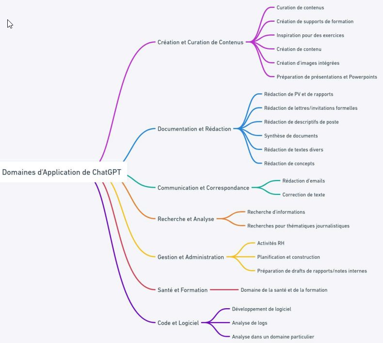
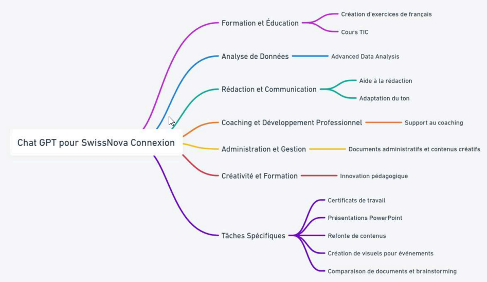
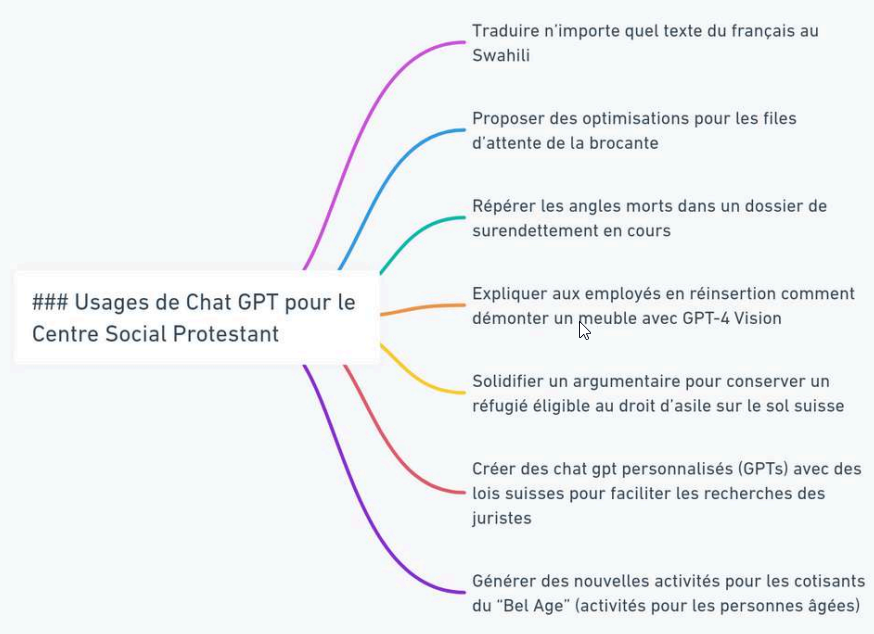
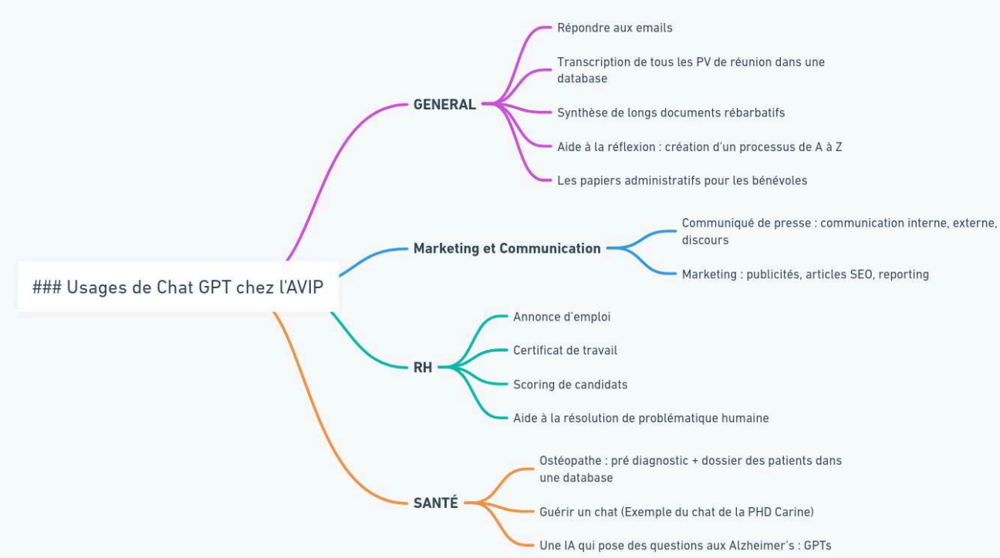

Utilisation de Zapier ou Make pour faciliter l'automatisation.

## Automatiser ses tâches avec ChatGPT - [méthode "Automato"](https://academieweb3.com/automatisation-chat-gpt/) de J.-B. Berthoux

#### Les types de tâches automatisables avec ChatGPT 

- Trouver des idées / Brainstormer
- Expliquer des concepts/synthétiser pour monter en compétence plus rapidement
- Coder, traduire, écrire avec Chat GPT
- Éditer, corriger, recycler du contenu
- Se mettre à la place d'un client cible
- Raisonnement 

#### Les tâches à faire faire par l'IA 

-> les non importantes et les ennuyeuses.

1. Listez toutes les tâches que vous effectuez dans votre travail quotidien.
2. Classez ces tâches en quatre catégories selon leur importance et leur niveau d'ennui: Important & Ennuyeux, Important & Non-Ennuyeux, Non-Important & Ennuyeux, Non-Important & Non-Ennuyeux.
3. Passez en revue les tâches classées comme "Non-Important & Ennuyeux" = les candidats à l'automatisation.
4. Évaluez les tâches sur leur aptitude à être automatisées avec Chat GPT.
5. Créez un plan d'automatisation pour chaque tâche.
    - Devez-vous rédiger un prompt avancé pour cette tâche ?
    - Est-ce que Chat GPT suffit ?
    - Est-ce que d'autres IA pourraient vous aider ?
    - Quel ROI pouvez-vous attendre?
6. Automatisez les tâches identifiées
7. Effectuez un suivi pour évaluer l'efficacité de l'automatisation.

## [Plan](https://preview.mailerlite.com/i9j2t3n2w8/2506794442950711882/q4k3/) de 60 jours (et 7 étapes) pour intégrer l'IA en entreprise par J.-B. Berthoux

#### Etape 1 : Formation d'acculturation

1.	L'IA générative : qu'est ce que c'est, les différentes IAGen (images, son, texte, vidéo), impact sur l'emploi, limites (confidentialité et sécurité) et forces.
2.	Chat GPT Fondation : fonctionnement, erreurs à ne pas faire, fondamentaux du prompt engineering
3.	Exercice pratique et ludique
   
<u>Objectif</u> : Faire passer tous les collaborateurs du niveau 1 au niveau 2. Montrer aux “sceptiques” qu'il ne faut pas avoir peur de ces outils. Ils ne sont pas “intelligents”, seulement de bons assistants.
<u>Gain</u> : L'IA améliore de 20 à 80 % la productivité sur un large éventail de tâches, sans intégration poussée, d'après les études (Source : Ethan Mollick, One Useful Thing).

#### Etape 2 : Formation sur vos applications métiers - J+15

1. Tour de table : comment avez-vous utilisé les outils IA dans les 2 dernières semaines ?
2. Fonctionnalités avancées de Chat GPT / Copilot : GPT-4, GPT-4 Vision, Dall E 3, Code Interpreter, automatisation.
3. Applications pratiques pour votre entreprise (avec applications externes et prompts)
4. Discussion de groupe : quelles sont les top3 tâches où l'IA générative aura le plus d'ajoutée pour toi ?
5. Conclusion

<u>Objectif</u> : avoir une carte mentale avec toutes les tâches utiles pour votre entreprise

#### Etape 3 : Créer une task force IA pour rentabiliser la formation - J+20

Pour :
- Prioriser les tâches à accélérer / automatiser en mettant à plat les processus
- Sourcer les meilleures utilisations des IAG dans tous les services
- Superviser la mise en place des solutions techniques
- 
Ressources minimales : un IT pour la sécurité et la confidentialité, un chef de projet pour les processus, un profil business pour l'approche ROiste.

#### Etape 4 : Mettre en place Chat GPT Team - J+20

Chat GPT Team garantit un niveau de confidentialité minimale. Une licence par équipe suffit pour commencer.

Créer des GPTs partageables entre les collaborateurs pour les usages prioritaires. Exemples :
- un GPT créateur d'annonce d'emploi pour la RH,
- un GPT créateur de post Linkedin pour le DG,
- un GPT d'analyse de data financières.

#### Etape 5 : Ajout d'applications utiles - J+30

Transcription de visio-conférence = AI companion de Zoom, Whisper dans Teams.
Création de powerpoint automatique = Gamma.app

#### Etape 6 : POCs et automatisation en no-code - J+40
Avec Zapier, Make, Bubble, tu peux créer des POCs (Proof Of Concept) d'applications sans compétences en programmation.
Cela permet de faire des tests à moindre de coût et de passer à l'étape suivante plus sereinement.
Ex : automatisation Make/Zapier du processus de création d'annonce d'emploi.
Ex : automatisation Make/Zapier de la rédaction de fiche produit en e-commerce avec GPT-4 Vision + génération de texte.
Ex : une IA FAQ pour ton site web = Botpress, Zapier Central ou Voiceflow

#### Etape 7 : Création de solutions sur mesure - J+60 et plus

ChatGPT et no-code pas toujours suffisant -> RAG, etc.

#### En résumé : 

- cela prend du temps
- résistance des employés
- erreurs et difficultés en perspective

[Notes](https://preview.mailerlite.com/p1e1j1s1k6/2509370773353797788/q1w9/) de J.-B. Berhtoux 

Les experts sont les plus à même de rédiger des prompts complexes et efficaces pour les tâches qu'ils connaissent. Une approche du haut (direction) vers le bas (employé) ne sera pas suffisante pour la succès d'une stratégie d'IA générative. 

Condition : avoir Chat GPT Team ou une interface interne avec des assistants. 
1. **Analyse rapide de l'organisation**
* <u>Objectif</u> : comprendre la structuration de l'organisation et identifier les pôles clés.
* <u>Étape</u> : analyser les départements tels que : 
    - Formation et Ressources Humaines (RH)
    - Marketing et Communication
* <u>Action</u> : identifier les tâches et processus dans chaque pôle où les IA peuvent apporter une valeur ajoutée.

2. **Création rapide des assistants de base**
* <u>Objectif</u> : développer rapidement des prompts pour les assistants IA.
* <u>Méthode</u> : utiliser un framework pour créer des prompts spécifiques à chaque tâche identifiée.
* <u>Action</u> : déployer ces prompts en utilisant les GPTs avec Chat GPT Team pour fournir des solutions clé en main aux équipes.

3. **Adoption et utilisation des outils**
* <u>Objectif</u> : permettre aux équipes de s'approprier et d'utiliser les nouveaux outils IA.
* <u>Étape</u> : les équipes commencent à utiliser les assistants IA pour leurs tâches quotidiennes.
* <u>Action</u> : observation et collecte de feedback sur l'efficacité des assistants IA.
  
4. **Intervention des experts pour amélioration**
* <u>Objectif</u> : améliorer les assistants IA de base avec l'expertise spécifique.
* <u>Participants</u> : réunir les experts de chaque tâche à valeur ajoutée 
* <u>Méthode</u> : 
    - Chaque expert travaille sur l'assistant IA de base dans son domaine.
    - Exemple : Un expert en annonce d'emploi améliore l'assistant pour les annonces d'emploi ; un tuteur expérimenté peaufine l'assistant pour le tutorat ; un spécialiste de LinkedIn perfectionne l'assistant pour les posts LinkedIn.

5. **Création de custom app si besoin**
* <u>Approche</u> : Sur une sélection de use case à fort ROI, créez des custom apps 
* <u>Action</u> : Si les assistants IA sont jugés limités, l'IT créé des solutions customisées pour répondre aux besoins spécifiques.
* <u>Étape</u> : Mise en production des solutions customs et boucle de rétroaction avec feedback des utilisateurs 

Quelques [observations et conseils](https://academieweb3.com/comment-integrer-lia-en-entreprise) de J.-B. Berhtoux 

* Gain d'efficacité indéniable pour les entreprises grâce à l'IA. Selon une étude conjointe du MIT et Stanford, ChatGPT améliore la productivité de 14% en moyenne, soit environ 1h par jour ; avec certaines applications IA, le gain peut même bondir jusqu'à 56% sur certaines tâches.
* 80% des professionnels n'ont pas le temps de rédiger des prompts ou de créer des chatbots personnalisés.
* Il faut montrer le bénéfice de l'IA en entrant par l'usage. 
* Pour intégrer l'IA en entreprise, créer un portail IA avec [Zapier Interface](https://zapier.com/interfaces) où chaque employé pourra sélectionner un chatbot pour l'aider sur des tâches précises.

## Quelques exemples d'utilisation dans le monde professionnel

(source : [cours](https://file.notion.so/f/f/e0c4cd4c-5dcc-4d82-b312-433753e87d14/4ab9ad2d-2bdb-4904-ba8c-b9e43924ca52/Inter_-_17_Juin_vf.pdf?id=ea0ab4a0-2f4b-4e8d-bbde-2733fb1275c6&table=block&spaceId=e0c4cd4c-5dcc-4d82-b312-433753e87d14&expirationTimestamp=1718949600000&signature=_a3ZrDAE8lNMhhii9fF04jyETrRPj7W2iyWz-PPJPfM&downloadName=Inter+-+17+Juin_vf.pdf) J.-B. Berthoux)

- Utiliser les arbres de raisonnement pour aller plus loin : "3 experts discutent de cette question lors d'une table ronde, essayant de résoudre étape par étape tous ensemble, en débattant d'éventuels désaccords"
- Les GPTs pour créer des personas
- Faire de la synthèse de longs documents avec Claude 3 Opus ou Gemini 1.5 Pro.
- Utiliser de concert plusieurs outils IA
- Créer des chatbots FAQ
- Utiliser le RAG pour aller faire des recherches dans des documents de 500 pages.

.

.

.

7.	IA et monde du travail

Comme toute innovation technologique, l'arrivée de l'IA dans le champ professionnel impacte le monde du travail. Et là où les (r)évolutions technologiques précédentes chamboulaient les rôles et les activités des êtres humains, l'IA atteint « son identité propre : son intelligence » (Côté et Su 2021). Si l'automatisation par les machines « a remplacé le labeur humain, l'automatisation numérique tend à se substituer à la pensée humaine et au traitement de l'information » (Côté et Su 2021). Mais l'IA pourrait envahir notre quotidien professionnel sans affecter la productivité et la performance économique des entreprises, comme l'ont fait les ordinateurs (paradoxe de Solow ; Mougeot 2023).

Par rapport à d'autres innovations technologiques qui lui ont précédé dans le monde du travail, « l'IA générative se distingue par son ancrage dans la réalité et son impact, à la fois mesurable et immédiat » (Ragetly 2023). Selon des chiffres publiés l'été passé, près de 30% des employés interrogés aux Etats-Unis utilisaient ChatGPT dans le cadre de leur travail (Corric 2023), un taux qui se montait à 22% (jusqu'à 33% dans certains secteurs comme la technologie ou les médias) selon une étude internationale du cabinet McKinsey publiée en avril 2023. Et selon une étude de Crédit Suisse, 30% de tous les nouveaux codes informatiques seraient générés avec de l'assistance IA (ChatGPT, GitHub Copilot, etc.) (Badri et al. 2023). Pour comprendre cette appropriation fulgurante pour des tâches productives, il faut sans doute également placer l'ouverture de l'IA générative au grand public dans un contexte post-pandémie COVID-19. Cette dernière a accéléré le tournant numérique dans de nombreux milieux professionnels et a « propulsé le développement de l'IA en accélérant l'adoption de trois grandes tendances » que sont le télétravail, l'optimisation de l'automatisation ainsi que le commerce et les transactions en ligne (Côté et Su 2021). Pour les administrations publiques, l'urgence de la situation sanitaire a par ailleurs mis en lumière la nécessité de services digitaux gouvernementaux (Mergel et al. 2023).
L'impact de l'IA sur le marché du travail pourrait être d'autant plus conséquent que, sur le plan économique, l'automatisation numérique est aisément duplicable (Côté et Su 2021). L'hypothétique destruction d'emplois qu'elle engendrerait fait régulièrement les gros titres. Cette crainte ne date toutefois pas de hier : ces funestes prédictions apparaissent dès les années 1960 et la mise au point des premiers robots (Ezratty 2019). Oscillant entre 6% et 47% d'emplois menacés, elles s'avèrent souvent bancales, surtout lorsqu'elles sont extrêmes (Ezratty 2019). Ainsi, la disparition de 47% d'emplois à l'horizon 2023 prévue dix ans plus tôt ne s'est pas réalisée. Comme le relève Ezratty (2019), ces évaluations sont rarement fiables : elles se basent sur des modèles simplistes, incapables d'appréhender la complexité de la recomposition du monde professionnel (création de nouveaux métiers, transfert du travail entre acteurs, etc.). Ce n'est pas tant en termes d'emplois remplacés qu'il convient de réfléchir, mais au sein de chaque profession, les tâches qui pourraient l'être (Ezratty 2019 ; Côté et Su 2021). 
La généralisation de l'IA pourrait également exacerber des problèmes structurels tels que la pénurie de profiles particuliers à haut niveau de formation dans les domaines technologiques et la surabondance de main-d'œuvre peu qualifiée (Mettler 2023). En outre, la popularisation de nouveaux outils intelligents amènera certainement à de nouvelles catégories d'emplois (fonctions stratégiques autant que prompt engineer) et une reconfiguration du profil recherché des employés. Ces derniers devront non seulement se montrer à l'aise avec ces nouvelles technologies, mais aussi développer des habiletés cognitives complexes (leadership, compétences sociales et émotionnelles, etc.) qui restent pour l'heure hors de portée des machines (Côté et Su 2021). L'IA générative amène également une transformation de la perception des compétences des travailleurs : « là où, historiquement, les «doers» étaient encensés, demain, l'une des qualités principales recherchées par les entreprises sera celle de «savoir faire faire » » (Ragetly 2023). Plutôt que d'opposer forces de travail humaine et robotique, Côté (Côté et Su 2021) appuie la nécessité de la coopération entre les êtres humains et les machines intelligentes en soulignant la complémentarité de leurs aptitudes (entre autres, tâches répétitives ou dangereuses pour l'IA ; créativité, jugement critique, éthique, empathie, etc. propres aux humains) qui résulterait en une augmentation des travailleurs.

8.	L'IA dans les administrations publiques

8.1.	Transformation digitale des administrations publiques 

Placer l'adoption de l'IA dans le processus plus englobant de transformation digitale des administrations permet de saisir ces nouvelles pratiques non seulement sous leur aspect technique/technologique, mais d'interroger également les chamboulements en termes d'identités, de prestations et de procédures qui l'accompagnent (Mettler 2023).
L'utilisation de l'IA, principalement générative, dans le monde professionnel y compris par des non-spécialistes peut être vue comme une innovation aussi bien managériale (« une solution qui apporte à un problème une réponse plus efficace, plus performante, plus soutenable ou plus équitable que les processus, prestations ou produits existants ») que systémique (« un processus de changement radical induisant une restructuration des routines quotidiennes et des flux de ressources [qui débouchant] tôt ou tard sur une transformation de l'organisation, de sa culture, de ses structures et de ses processus » (Neumann et Mettler 2023). L'adoption de telles solutions innovantes par une entreprise ou une administration est à placer dans la trajectoire de transformation digitale que suivent ces organisations. La transformation digitale – à ne pas confondre avec la digitalisation (le « passage de supports d'information analogiques [..] à une forme digitale ») – peut se définir comme le « recours aux technologies de l'information dans le but de repenser les routines et processus quotidiens, voire de les redéfinir ou de concevoir des solutions inédites pour répondre à des questions d'ordre stratégique » (Mettler 2023). Elle englobe des innovations aussi bien en termes de communication, de coopération que de coordination. 
Mettler (2023) identifie 5 principaux stades de transformation digitale au sein des administrations, celle-ci se faisant numérique (cyberadministration : digitalisation, portails web, amélioration des processus internes, etc.), mobile (applications mobiles, etc.), ouverte (transparence, libres accès et réutilisation des données, applications ouvertes, etc.), digitale (écosystèmes numériques, logique de plateforme, modèles d'affaires digitaux etc.) avant d'être intelligente (fusion des modes physiques et digitaux (ex. : internet des objets), IA, analyse prédictive, administration proactive (élaborer des scénarios), etc.). L'intelligence artificielle est donc au cœur de cette dernière phase, aussi appelée smart government. Pour y contribuer, les prestations qu'elle permet doivent notamment être intégratives (accès par un portail unique), personnalisées et performantes aussi bien pour le public extérieur que pour les employés (Mettler 2023). Maitriser cette dernière vague de la transformation digitale implique des adaptations structurelles (e.g. nouvelles compétences recherchées sur le marché de l'emploi) culturelles (e.g. transparence) et comportementales (e.g. approche collaborative) (Mettler 2023).

8.2.	Particularités du secteur public

Quand elle a lieu au sein des administrations publiques, la transformation digitale comporte divers enjeux spécifiques à ne pas négliger. Comme d'autres innovations digitales, l'intégration de l'IA à la sphère professionnelle soulève de nombreux enjeux éthiques. Du point de vue des employés, la collecte de données lors de l'utilisation des nouveaux utilitaires informatiques exacerbe le risque de surveillance excessive de leur performance au travail (Côté et Su 2021). Quand il s'agit du secteur public, l'innovation et la digitalisation doivent ainsi contribuer à l'amélioration des prestations publiques, au service de la société et de l'économie du pays (Mettler 2023 ; Neumann et Mettler 2023). Avec l'IA, les questions ayant trait à la préservation des libertés individuelles, même en cas de prise de décision automatique, la protection des droits d'auteur, la transparence, les limites à imposer au profiling des citoyens se posent avec d'autant plus d'acuité (Mettler 2023). En effet, selon le modèle wébérien, qui appréhende l'administration publique sous un angle rationnel et légal, « le respect de la règle de droit […], le sens de l'intérêt général et les principes de neutralité et d'égalité de traitement […] définissent la ligne organisationnelle et le comportement de celles et ceux qui sont au service de l'État » (Weerts 2023b). De surcroit, l'action de l'administration publique doit garantir le respect d'un ensemble de valeurs qui sont le produit d'une évolution historique, sociale et culturelle, notamment des valeurs dites « publiques » qui relèvent des principes du droit public, qu'il soit constitutionnel (e.g. protection des minorités) ou administratif (e.g. transparence, impartialité) (Weerts 2023c). Contrairement à une entreprise privée où les préférences individuelles peuvent décider de l'orientation d'une organisation, celle des administrations publiques est contrainte par les contextes juridique et politique. De façon intéressante, la transformation digitale (et l'IA générative en particulier) pose également l'enjeu de l'arbitrage entre des valeurs plus récemment associées à la fonction étatique (innovation, mesure de la performance) et d'autres établies de longue date (prise en compte de toutes les strates de citoyens, qu'ils soient à l'aise avec ces nouvelles technologies) (Weerts 2023c).
Le secteur public constitue donc un univers professionnel particulier, où les principes de transparence, responsabilité, fiabilité, égalité et impartialité doivent être assurés pour conserver la confiance des citoyens (CEU 2023). En tant que démarche innovante, l'adoption de l'IA peut contribuer favorablement à cette dernière : « [s]i les prestations de l'administration n'évoluent pas suffisamment rapidement, alors que le monde se transforme, d'autres acteurs se chargeront de combler les espaces créés par ce manque de dynamisme, confrontant l'État à un problème de légitimité » (Neumann et Mettler 2023). Depuis les années 1990 en effet, les valeurs d'efficience, d'innovation et d'orientation client en provenance du secteur privé ont infusé dans la sphère publique (Weerts 2023c). L'exercice demeure néanmoins risqué et la vigilance requise, comme l'illustrent les scandales ayant touché les autorités néerlandaises (discriminations ethniques ; Amnesty International 2021) ou plus récemment autrichiennes (discriminations de genre ; Courrier international 2023) en sont des exemples édifiants. La question de la fiabilité des systèmes se pose de manière particulièrement aiguë : une mauvaise expérience par les administrés d'un outil IA ou une médiatisation nuisible pourrait induire une aversion plus généralisée envers cette technologie (un effet appelé transfert algorithmique ; Longoni et al. 2023).
Les IA génératives comme ChatGPT se distinguent d'autres IA par leur caractère langagier, ce qui n'est pas anodin quand cela concerne le secteur public. En effet, « [l']administration produit du langage et ce qu'elle énonce est un acte d'autorité et de pouvoir » (Cantens 2023). Que se passe-t-il quand celui-ci est produit par une machine ? Quelle sera la valeur légale de la réponse d'un chatbot ? S'il n'existe pas, à ma connaissance, de réponses claires à ces questions, nul doute qu'elles se poseront avec d'autant plus d'acuité à l'avenir. L'autorité conférée aux institutions étatiques revêt également une dimension politique. Avec, avec la recherche d'efficience et d'efficacité technique et technologique à laquelle le recours à l'IA participe, s'accentue le risque que la rationalité technologique se substitue à la « rationalité politique symbolique » de l'Etat (Ménissier 2022). Etant admis « que l'efficacité d'une institution n'est pas à chercher dans l'ordre uniquement pragmatique », c'est la « perte du sens politique de l'institution » qui guette (Ménissier 2022). 
Pour toutes ces raisons au moins, « le secteur public ne peut pas directement copier les stratégies de transformation numérique et les pratiques en matière d'IA du secteur privé » (Baudet et al. 2023).
8.3.	Usages de l'IA par le secteur public

Les investissements des administrations pour des technologies basées sur l'IA à des fins non militaires sont massifs (1 mia de dollars par l'administration fédérale américaine, 2 mia par la ville de Pékin en 2020 selon Campion et al. 2020 ; pour l'Union Européenne : 1.7 mia d'euros en 2020, un montant doublé en 2022 selon Pechtor et Basl 2023). Mais dans quels domaines l‘IA peut être utilisée au sein des administrations publiques ?
Wirtz et al. (2019) identifient les applications suivantes (avant la popularisation des LLMs) : gestion des connaissances (knowledge management), automatisation des processus, agents virtuels, visualisation et analyse prédictive, identification, systèmes de recommandation, assistants digitaux, analyse de la parole, sécurité et renseignement. Elle est utilisée pour interagir avec les citoyens, combattre la fraude, optimiser la gestion du trafic, améliorer la modélisation des épidémies et les prédictions météorologiques ou perfectionner les systèmes de surveillance (Mergel et al. 2023 ; Badri et al. 2023), et revêt un grand potentiel pour optimiser les flux de données, améliorer l'efficience administrative ainsi que l'efficacité des processus opérationnels, assister les prises de décision et automatiser la création de document administratifs (Prof. Percia-David, communication personnelle). Les capacités, continuellement améliorées, des foundation models augmentent les technologies IA existantes et offrent de nouvelles possibilités dans des tâches telles que la communication (chatbots ou communications personnalisées avec les citoyens, rédaction ou simplification de textes gouvernementaux, aide à l'analyse de texte de lois, etc.) (Ada Lovelace Institute 2023 ; CEU 2023). Il ne faudrait évidemment pas oublier de mentionner l'utilisation informelle au quotidien d'interfaces basées sur l'IA pour améliorer leur productivité. 

8.4.	Facteurs d'influence de l'adoption de l'IA dans l'administration publique

Malgré les investissements importants dans le domaine, l'IA dans le secteur public reste un domaine de recherche sous-investigué (Baudet et al. 2023 ; Pechtor et Basl 2023). Un certain nombre de revues de littérature (e.g. Madan et Ashok 2023) ou articles de recherche (e.g. Maragno et al. 2023) se sont penchés sur l'adoption de l'IA dans les administrations publiques récemment. Les facteurs impactant celle-ci retombent quasi-systématiquement dans l'une de ces catégories : sociaux, économiques, technologiques, de données, organisationnels et managériaux, éthiques, politiques et légaux (Campion et al. 2020), parfois regroupées en quatre dimensions (technologique, légale et réglementaire, éthique, sociétale ; Wirtz et al. 2019). Parmi les déterminants cités de façon récurrente figurent notamment : la compatibilité avec les infrastructures et les processus existants, les profils des collaborateurs, les structures organisationnelles, le mode de fonctionnement à tendance inertielle des administrations publiques et l'encadrement managérial, législatif ou politique. La nécessité d'adaptations culturelles, impliquant par exemple une nouvelle façon de concevoir les interactions hommes-machines (Maragno et al. 2023) ou une ouverture au partage des données (Campion et al. 2020), est également soulignée. Je vais me contenter relayer ci-dessous quelques résultats obtenus dans deux études de terrain qualitatives conduites récemment en Suisse (Baudet et al. 2023 ; Pechtor et Basl 2023).
Dans la première étude, Baudet et ses collègues (Baudet et al. 2023) se sont penchés sur les facteurs d'acceptation de l'IA dans le secteur public suisse. Ces auteurs soulignent qu'un projet de mise en œuvre de l'IA « est un processus qui touche tant le niveau organisationnel que le niveau individuel » (Baudet et al. 2023). Parmi les obstacles à l'adoption de l'IA, Baudet et ses collègues relaient les problèmes liés aux outils d'IA (ex. : fonctionnement en boite noire, erreurs du modèle, biais), aux utilisateurs (ex. : aversion aux algorithmes, préjugés des utilisateurs) ainsi que divers problèmes opérationnels (ex. : données manquantes, complexité des parties prenantes). Ils mentionnent également les prérequis nécessaires en termes de données et d'infrastructure technologique (Baudet et al. 2023).
Au niveau individuel, les fonctionnaires reconnaissent les potentiels gains en productivité et qualité, de même qu'en économie de ressources. L'acceptation par ces derniers d'outils IA permettant de gagner en efficacité dans le travail administratif est perceptible, d'autant plus si la mise en œuvre peut se faire sans trop d'efforts (Baudet et al. 2023). L'utilisation de l'IA pour la prise de décision rencontre davantage de réticences, bien que certains soulignent une meilleure équité de traitement réalisée par la machine. Les personnes interrogées ont également fait part de leurs préoccupations quant à l'explicabilité et à la fiabilité des résultats fournis par la machine. Cette étude souligne également le manque de compréhension des principes techniques sous-jacents à l'IA et la nécessité d'acquérir des compétences supplémentaires pour utiliser ces nouveaux outils. Les auteurs concluent : « afin de lever les freins pour l'acceptation d'une IA, former les fonctionnaires sur les principes de l'IA est une priorité » (Baudet et al. 2023). En acquérant davantage de compétences dans le domaine, l'acceptation est favorisée car l'effort attendu semble moindre. Les chercheurs ont aussi pu constater que la peur du remplacement de l'humain par la machine affecte tous les niveaux hiérarchiques et l'aversion au changement de certains fonctionnaires peut porter préjudice à la mise en œuvre de projets innovants (Baudet et al. 2023). Une perception positive de l'IA par les cadres ou certains collaborateurs peut influencer son acceptation par leurs autres collègues (Baudet et al. 2023).
Les gains en performance espérés sont également évoqués au niveau institutionnel. L'importance de la disponibilité de ressources, de l'accompagnement des collaborateurs et de la communication interne pour expliquer que le but recherché n'est pas le remplacement des fonctionnaires par l'IA est également soulignée. Pour la conduite du projet, un avancement progressif dans la mise en œuvre, la participation active des fonctionnaires, de même que les collaborations avec les partenaires internes comme externes sont autant de critères de réussite reportés (Baudet et al. 2023).
Dans une autre étude conduite dans les administrations publiques suisses, Pechtor et Basl (Pechtor et Basl 2023) remarquent que les projets IA analysés sont le fruit d'initiatives individuelles et n'ont pas d'organisation centralisée ni de procédures dédiées. De plus, la dispersion des spécialistes à travers les différents départements limite les possibilités d'interactions entre eux (Pechtor et Basl 2023). La composante sociale est un autre facteur identifié comme important. Sur le plan technique, les chercheurs relèvent les complications liées aux infrastructures techniques et le manque de compatibilité avec les systèmes existants (standardisation des données, puissance de calcul, accès restreint aux services de cloud, etc.). Les auteurs le redoutent : accordant une très haute importante à la protection et de la confidentialité des données, les administrations publiques suisses risquent de ne pas faire preuve de la flexibilité nécessaire au déploiement des nouvelles technologies IA – alors même que des technologies existent pour garantir une adoption sécurisée et conforme de ces outils (Pechtor et Basl 2023). L'environnement dans lequel les administrations évoluent n'est pas toujours favorable. La pénurie de talents et la difficulté à retenir les personnes compétentes affectent moult organisations (Pechtor et Basl 2023). En outre, l'adaptation des règlements ou des lois peuvent parfois être nécessaires. En dernier lieu, bien que l'importance de la digitalisation soit reconnue au niveau politique, l'IA n'a pas encore trouvé sa place dans les programmes politiques cantonaux ou communaux (« there is goodwill to support initial AI initiatives without explicitly demanding more effort in AI » ; Pechtor et Basl 2023).

8.5.	Freins à l'adoption de l'IA dans le secteur public

Certaines embûches ralentissent l'innovation et la transformation digitale tout au long du processus. Pour commencer et de manière générale, le déploiement de technologies numériques avancées suscite des inquiétudes, qu'elles soient ou non justifiées (Mettler 2023), comme cela a été constaté dans les deux études détaillées plus haut. La personnalité des employés du secteur public (« axé[e]sur un mode de travail précis et efficace ») jouerait également en sa défaveur, tout comme le manque de pression concurrentielle (Neumann et Mettler 2023). De façon inhérente, et à l'inverse du secteur privé, il cherche surtout à diminuer les risques plutôt qu'à maximiser les bénéfices (Pechtor et Basl 2023). Une stratégie qui n'encourage pas l'adoption de pratiques technologiques innovantes.
La culture de l'organisation, si elle revêt « un formalisme excessif, des méthodes de travail technocratiques ou un mode de pensée très hiérarchique », peut également gêner l'adoption de nouvelles pratiques digitales (Mettler 2023). En outre, l'administration publique est souvent caractérisée par une approche hiérarchique top-down, « des processus relativement bureaucratiques et par un « esprit de clocher » » qui ne facilitent pas les processus d'innovation (Neumann et Mettler 2023). Un constat partagé par Pechtor et Basl (Pechtor et Basl 2023), qui y ajoutent une gouvernance centralisée, une faible maturité data, des infrastructures parfois inadéquates ainsi que des financements insuffisants comme facteurs défavorables.
Orientée vers l'intérêt général, l'administration publique ne peut se limiter à une gestion managériale mais doit également se reposer sur des piliers juridique et politique (Yair 2014). Les questions de protection des données et de la vie privée (e.g. surveillance et contrôle de la population) se posent de manière particulièrement sensible. Le cadre légal strict qui régit la sphère publique peut s'avérer davantage contraignant (Baudet et al. 2023 ; Pechtor et Basl 2023 ; Weerts 2023a). 

8.6.	Catalyseurs à l'adoption de l'IA dans le secteur public

L'adoption d'outils basés sur l'intelligence artificielle peut se percevoir comme un processus d'innovation. Pour que ce dernier et l'implémentation de l'IA soient une réussite, il convient de prévoir et structurer les différentes phases du cycle de vie d'un tel projet comme tel (e.g. planification, réalisation, contrôle et passage à l'action ; Neumann et Mettler 2023). Baudet et ses collègues (Baudet et al. 2023) proposent un nouveau modèle en 4 phases (initialisation – décision d'adoption – implémentation – acceptation et usage) qui permet d'identifier les facteurs d'adoption et d'acceptation de l'IA. Il en découle des recommandations pour chacune de ces étapes pour faciliter l'implémentation de l'IA. De manière non exhaustive, nous pouvons citer : une délimitation claire de la finalité de l'IA et la formation des collaborateurs (phase 1), la prise en compte des déclencheurs et des prérequis techniques (phase 2), l'acquisition des compétences indispensables à l'implémentation, la mise au point d'un plan de gouvernance, de même que la conduite du changement et la collaboration interne ou externe (phase 3), finalement, une communication appropriée selon le public cible sur les bénéfices et limites de l'IA et l'accompagnement des utilisateurs (phase 4). Adopter une approche agile, favoriser les démarches itératives et cultiver la tolérance aux erreurs sont également des facteurs de succès importants (Mettler 2023 ; Neumann et Mettler 2023). Au niveau du pilotage de l'organisation, il y a lieu de s'assurer que l'innovation occupe une importance adéquate dans la stratégie de l'organisation et le déploiement de celle-ci (Neumann 2023).
En termes de ressources humaines, il est intéressant de repérer les personnes dotées de compétences techniques et métiers, qui peuvent fonctionner comme des « traducteurs » entre les univers « business » et « IT » (Mettler 2023) et « ambassadeurs » des solutions innovantes (Corthésy 2023). Pour chaque projet en particulier, cela peut aider d'avoir un responsable bien identifié qui se l'approprie et le porte (Neumann et Mettler 2023). Les autres employés ne sont pas en reste : ils doivent continuellement se former aux nouvelles technologies et les chefs adapter leur style managérial. La formation (continue) et la requalification des travailleurs est de fait une mesure facilitatrice qui fait consensus dans la littérature (e.g. Côté et Su 2021 ; Baudet et al. 2023) ; Blangeois 2023 ; Corthésy 2023). 
Dans une même veine, les organisations pourraient mettre davantage de ressources à disposition des fonctionnaires, avec un double objectif. Tout d'abord, encadrer l'usage d'outils comme ChatGPT en vue d'assurer une utilisation conforme à l'éthos de l'administration publique. Selon une étude de Salesforce plus d'un tiers des employés en Suisse avaient utilisés des outils IA interdits par leur entreprise, et plus du trois quart des entreprises n'avaient pas défini de lignes claires à ce propos (Madonna 2023). Ensuite pour favoriser les échanges entre employés et mutualiser leurs connaissances (par exemple via l'élaboration collaborative d'une bibliothèque de prompts ; Corthésy 2023, p. 179). Plus de 60% des employés interrogés par cette même enquête font passer les résultats de l'IA pour les leurs (jusqu'à plus de 85% dans le domaine des sciences et de la technologie) ; selon une étude Ifop-Talan, «68% des travailleurs utilisant ChatGPT le cachent à leur hiérarchie » (Corthésy 2023, p. 175). Davantage de communication et la valorisation de ces nouvelles compétences introduirait peut-être une transparence bénéfique à l'ensemble des collaborateurs.
Au niveau structurel, de nouveaux modes d'organisation « qui utilisent la technologie pour tirer le meilleur parti des individus » sont également prônés (Côté et Su 2021 ; Mettler (2023) le rappelle : ce sont plutôt des initiatives « de bas en haut » qui, au prix d'un changement de mentalité, portent de nouvelles habitudes pour « la fourniture de prestations digitales intelligentes ». Comme changement organisationnel qui pourrait faciliter l'adoption de solutions IA, celles-ci pourraient être portées par un pôle d'innovation transversal, espace de liberté pour les employés, qui favoriserait l'émergence de nouvelles idées tout en assurant un déploiement efficace par des interactions étroites avec les offices métier (Neumann et Mettler 2023).
Il est par ailleurs crucial de réfléchir à l'objectif recherché par l'adoption d'une nouvelle technologie, car celle-ci « ne déploie pas d'effets du fait de sa seule existence ; elle ne peut avoir un impact que si elle est utilisée » (Mettler 2023). Pour que le personnel se l'approprie, une solution IA doit être pertinente et faire sens pour les employés. Cela a par exemple transparu dans l'étude de Baudet et al. (Baudet et al. 2023), qui ont identifié la demande du métier ou la réponse à une situation d'urgence comme principaux déclencheurs de l'implémentation d'une solution IA dans les organisations enquêtées (auxquelles s'ajoute également une volonté politique). Dans une communication personnelle, le Professeur Percia-David (spécialiste des LLMs à la HES-SO Valais) m'a rappelé l'importance de ne pas céder à la « tendance de mettre de l'IA partout » : celle-ci ne sert pas tous les besoins et certaines démarches (parfois représentatives d'un stade antérieur de la transformation digitale telles que la numérisation des documents) doivent être mises en œuvre prioritairement.
Finalement, l'intelligence artificielle est une discipline complexe qui, pour être finement comprise demande des connaissances scientifiques particulières. Il semble donc particulièrement de chercher des collaborations à l'externe avec des partenaires à la pointe dans ce domaine pour la mise au point de solutions technologiques adaptées et fiables (Neumann et Mettler 2023). En ce qui concerne notre office, nous pourrions nous appuyer sur des hautes écoles présentes dans le canton (l'institut Idiap spécialisé dans l'intelligence artificielle, la HES-SO et son pôle dédié aux LLMs), ou des start-up expertes dans le domaine comme par exemple Novatix (basée dans l'arc lémanique).

*Sources*
* "[ChatGPT en entreprise](https://outilia.fr)" de Matthieu Corthésy

## Points d'attention pour une intégration en entreprise

informer, former, montrer les bénéfices
penser au support à apporter une fois l'IA implémentée
gains de productivité rarement immédiats, planifier et évaluer sur le long terme

## Méthode SPARK en 5 étapes

1. définir le potentiel
  - sensibiliser les équipes, écouter les résistances internes/craintes (ex. formations, sessions questions-réponses)
  - identifier des ambassadeurs
  - mener un audit des besoins par métier (cartographier les besoins, repérer les tâches potentiellement délégables à l'IA)
2. sélection des outils
  - évaluer différents outils (généraux, spécifiques, chatbots personnalisés, etc.)
  - mener un projet pilote
3. déploiement
  - achat de licenses
  - intégration technique
  - création de bibliothèques de prompts
  - support continu
4. formation des équipes 
  - workshops, sessions questions-réponses, ateliers pratiques, etc.
  - communication interne et externe claire et transparente
5. suivi et optimisation
  - suivi régulier et ajustements
  - rapports de performance des KPI

## Exemples

* ChatBot de l'[Association Jura & Trois-Lacs Tourisme](https://www.j3l.ch/) basé sur ChatGPT ([article RTS](https://www.rts.ch/info/economie/14186432-lintelligence-artificielle-debarque-dans-les-offices-de-tourisme-en-suisse.html))
* Batmaid a automatisé son système de paie en un temps record avec ChatGPT - la plateforme de ménage à domicile utilise la technologie d'OpenAI pour simplifier les activités internes de ses opérateurs administratifs et ses agents de nettoyage, et gagner en efficience. [Article AGEFI](https://agefi.com/actualites/entreprises/batmaid-a-automatise-son-systeme-de-paie-en-un-temps-record-avec-chatgpt)


