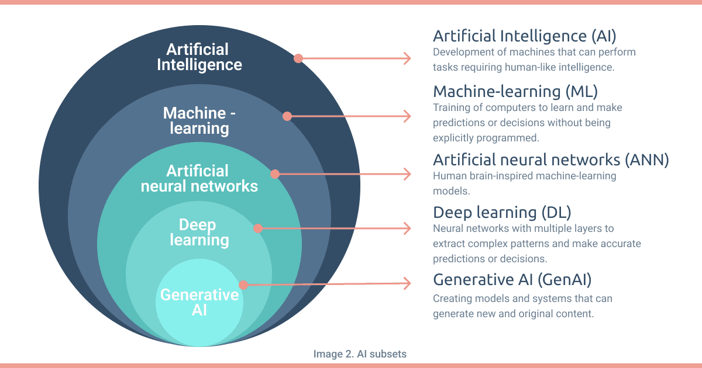

*Sources :* 
* [*Guide publié par l'Etat de Genève*](https://www.ge.ch/document/guide-intelligence-artificielle)
* [*PME Magazine*](https://www.pme.ch/dossiers-et-hors-series/2023/09/19/comment-utiliser-lintelligence-artificielle-pour-doper-votre-entreprise-632768)
* [*Novatix*](https://www.novatix.ch/services/intelligence-artificielle)
* Cours "Intelligence artificielle: Une perspective pragmatique pour professionnel-les non-spécialistes" (Prof. Di Marzo / Krebs / Friha, UNIGE)

## Définition

L'intelligence artificielle fait référence au développement de systèmes
informatiques et
d'algorithmes capables
d'effectuer des tâches
nécessitant généralement
l'intelligence humaine, telles
que l'apprentissage, la
résolution de problèmes et la
prise de décision.

## Contexte et bref historique

## Différentes catégories d'intelligence artificielle (IA)

Nombreuses classifications possibles... Quelques catégories fréquentes :

<u>Apprentissage supervisé</u> : l'algorithme apprend à reconnaitre des éléments (images, sons, etc.) à partir d’une grande quantité d’exemples.
  - régression 
  - classification

<u>Apprentissage non supervisé</u> : l'algorithme apprend des données sans nécessité d'étiquetage.
  - clustering
  - réduction de dimension

<u>Apprentissage par renforcement</u> : l'algorithme apprend en étant récompensé pour une victoire et puni pour une défaite ; il génère une règle qui définit la meilleure stratégie pour obtenir le plus de récompenses possibles.

<u>IA sémantique</u> : structuration des connaissances (graphe de connaissances, ontologie) ; ne requiert pas forcément de l'apprentissage automatique (*machine learning*) (ex: chatbot basé sur des règles, système expert)

<u>IA distribuée</u> : la charge et le traitement de la tâche sont répartis entre plusieurs agents autonomes qui interagissent (ex: modélisation de système complexe) ; associée ou non à du *machine learning* 

<u>IA générative</u> : l'algorithme crée du contenu (textes, images, traductions, etc.) à partir des instructions fournies, se base sur l'apprentissage profond (*deep learning*).

$`\neq`$

**IA $`\neq`$ GenAI** : bien que ce soit surtout l'IA générative (GenAI) qui fasse parler d'elle récemment, l'IA ne se limite pas à cela ! L'IA générative est en effet une sous-catégorie de l'*apprentissage profond*, qui est une sous-catégorie des *réseaux de neurones* qui sont une sous-catégorie de l'*apprentissage automatique* qui est une sous-catégorie de l'intelligence artificielle.

.

*source : https://www.engenome.com/news/AI-regulation/*

## Avantages de l'intelligence artificielle

* Large champ d’application
* Augmentation de la productivité, optimisation
* Réduction des intermédiaires
* Gain de temps et d’efficacité
* Capacité à prendre des décisions basées sur un nombre important de paramètres différents
* Réduction des coûts
* Automatisation des tâches, processus, supervision
* Aide à la prise de décisions
* Disponible en tout temps
* Apprentissage continu permettant d’améliorer les performances au cours du temps
* Optimisation des ressources
* Création de nouveaux métiers
* Prédictions (anticiper et s'adapter rapidement)
* Expérience clients (interactions sur mesure, marketing ciblé)
* Innovation

## Désavantages de l'intelligence artificielle

* Absence de jugement moral
* Perte de réflexion personnelle et de connaissances de base
* Baisse du niveau de compétences
* Nécessité d’accéder à un équipement informatique pour interagir
* Dépendance technologique
* Suppression d’emplois
* Connexion Internet requise la plupart du temps
* Biais algorithmiques et excès de confiance envers les outils
* Dépendance à la qualité des données d’entrainement auxquelles se réfère l’outil
* Consommation d’énergie

## Exemples d'utilisation en entreprise

1. Rédiger des e-mails et y répondre (ex. <chatgptwriter.ai> pour utiliser ChatGPT sans quitter sa messagerie)
2. Résumer un document
3. Analyser un document et fournir des critiques (ex. ChatGPT, Docalysis)
4. Concevoir une newsletter (choix des dates optimales, rédaction du contenu)
5. Rédiger une offre d’emploi
6. Brainstormer (ex. IdeaBot.ai, Ideaflip.com)
7. Aider à la programmation informatique (ChatGPT pour : coder une application, écrire des tests, identifier les bugs, optimiser du code, apprentissage, etc.)
8. Inventer un logo (DALL·E, Midjourney, Stable Diffusion, Tailor Brands, Designs.ai, DocLogo, etc.)
9. Créer un slogan
générateurs de slogans d’entreprise gratuits, qui utilisent l’IA, sont proposés sur des sites comme Zyro.com et Shopify.com.
10. Préparer des documents de présentation (format PowerPoint avec ChatGPT ; Beautiful.ai)

## L'IA va-t-elle prendre mon travail ?

L'IA a déjà débarqué dans le monde professionnel. Dès lors, la question est plutôt : comment utiliser pour améliorer mon travail et le rendre plus intéressant ?


